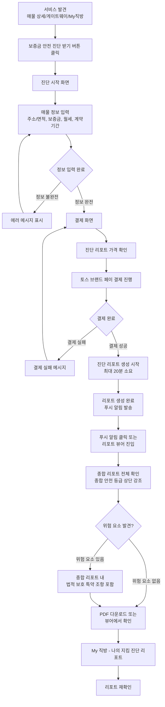

# PRD: 지킴진단 (Zikim Diagnosis)

**⚠️ 중요: PRD 작성 전 반드시 확인하세요**
- PRD 작성 가이드라인: `docs/Template/PRD_GROUND_RULES.md`를 먼저 읽고 준수하세요.
- 핵심 원칙: **Logic over Tech** - 기술적 구현 상세가 아닌 비즈니스 로직과 정책 중심으로 작성합니다.

---

## 1. 개요 (Overview)

### 1.1 문서 정보

```
작성자: [Gina Chang]
작성일: 2024년 12월 12일
최종 수정일: 2024년 12월 12일
버전: 1.0
```

---

### 1.2 제품/프로젝트 이름

```
대상 서비스명: 지킴진단
기능명: 전/월세 매물 계약 안정성 진단 서비스
설명: 전/월세 매물 탐색 시, 사용자가 해당 매물의 계약 안정성에 대한 심층 진단 리포트를 유료로 제공받아 안전한 계약을 돕는 서비스
```

---

### 1.3 핵심 목표 (Goals)

**비즈니스 목표:**
- 매물 문의 건수의 30%가 지킴진단 서비스를 활용하도록 함
- 유료 진단 서비스로 수익 모델 확립
- 전세사기 방지 서비스로 브랜드 신뢰도 향상

**사용자 목표:**
- 계약 전 잠재적 위험(권리 관계, 보증금 회수 위험 등)을 사전에 파악
- 소중한 보증금을 보호하고 심리적 안정감 확보
- 안전한 계약을 위한 객관적이고 신뢰할 수 있는 정보 제공

---

### 1.4 성공 지표 (KPIs)

**Success Metrics (성공 지표):**
- 지킴진단 활용율: 매물 문의 건수의 30% (목표)
- 진단 리포트 구매 전환율: [TBD]% (목표)
- 사용자 만족도: 4.0/5.0 이상 (목표)
- 재구매율: [TBD]% (목표)

**Guardrail Metrics (안전장치 지표):**
- 사용자 이탈률 (진단 요청 후 결제 전): 목표 30% 이하

**측정 방법:**
- Zams 대시보드
- 주간 리포트 자동 생성

---

## 2. 배경 및 문제 정의 (Context & Problem Definition)

### 2.1 배경/동기 (Motivation)

**시장 동향:**
- 전세사기 사건이 지속적으로 발생하며 사회적 이슈로 대두
- 전세 계약 시 보증금 규모가 크고, 한 번의 사기로 인한 피해가 심각함
- 사용자들이 계약 전 매물의 안전성을 확인하고 싶어하지만 신뢰할 수 있는 정보를 찾기 어려움

**내부 전략:**
- 부동산 플랫폼의 차별화 포인트로 안전성 강조
- 사용자 신뢰 구축을 통한 장기적 사용자 확보
- 유료 서비스로 수익 모델 다각화

**사용자 피드백:**
- 전세사기에 대한 높은 불안감 (페르소나: 김지현의 주요 Pain Point)
- 계약 전 매물의 권리 관계, 근저당, 전세가율 등에 대한 정보 필요
- 객관적이고 전문적인 진단 정보에 대한 니즈

---

### 2.2 사용자 및 페르소나 (User & Persona)

**주요 타겟 사용자:**
1. 전세/월세 계약 예정자: 안전한 계약을 위해 사전에 위험을 파악하고 싶은 사용자
2. 보증금 규모가 큰 계약자: 큰 금액의 보증금을 보호하고 싶은 사용자
3. 전세사기 우려가 높은 사용자: 사회적 이슈로 인한 불안감을 해소하고 싶은 사용자

**페르소나:**
- 링크: `docs/Template/PERSONA_TEMPLATE.md`
- 대표 페르소나: 김지현 (30대 후반, IT 기획자) - 전세사기 방지를 최우선으로 고려하는 독신 거주자

**사용자 특성 및 니즈:**
- 전세사기에 대한 매우 높은 불안감
- 매물의 안전성(근저당, 전세가율, 집주인 신뢰도) 및 법적 보호 정보를 적극적으로 찾음
- 객관적이고 신뢰할 수 있는 정보 제공을 선호

---

### 2.3 해결할 문제 (The Problem)

**핵심 문제:**
전/월세 매물 계약 시, 사용자가 계약 안정성에 대한 객관적이고 신뢰할 수 있는 정보를 얻기 어려워 잠재적 위험을 사전에 파악하지 못하고 있음

**문제 상세:**
- 사용자가 계약 전 매물의 권리 관계, 근저당, 전세가율 등을 직접 확인하기 어려움
- 부동산 중개사나 집주인으로부터 제공받는 정보의 신뢰성에 대한 의문
- 전세사기 사례가 증가하면서 사용자의 불안감이 높아짐
- 전문적인 진단 정보를 제공하는 서비스가 부족함

**영향:**
- 사용자가 불안한 상태로 계약을 진행하거나 계약을 포기하는 경우 발생
- 전세사기 피해 발생 시 심각한 금전적 손실
- 부동산 플랫폼에 대한 신뢰도 저하

---

### 2.4 현재 상태 (As-Is)

**현재 프로세스:**
1. 사용자가 매물을 탐색하고 관심 매물을 선택
2. 부동산 중개사나 집주인으로부터 기본 정보를 받음
3. 사용자가 직접 등기부등본을 확인하거나 주변 정보를 수집
4. 불완전한 정보로 인해 불안한 상태로 계약 결정 또는 포기

**현재의 한계:**
- 사용자가 전문적인 정보를 직접 수집하고 분석하기 어려움
- 정보의 신뢰성과 객관성을 보장하기 어려움
- 시간과 노력이 많이 소요됨
- 전문 지식이 없는 사용자는 위험 요소를 놓칠 수 있음

---

## 3. 솔루션 및 범위 (Solution & Scope)

### 3.1 솔루션 제안 (Proposed Solution)

**핵심 가치 제안:**
계약 전, 잠재적 위험(권리 관계, 보증금 회수 위험 등)을 사전에 파악하고, 필요시 법적으로 보호받을 수 있는 특약을 제공해줌으로서 사용자의 소중한 보증금을 지키고 심리적 안정감을 제공합니다.

**주요 접근:**
- 매물 정보를 기반으로 전문적인 진단 리포트 생성
- 권리 관계, 근저당, 전세가율 등 계약 안정성에 영향을 주는 요소를 종합적으로 분석
- 객관적이고 이해하기 쉬운 형태로 위험 요소와 안전성 평가
- 유료 서비스로 제공하여 전문성과 신뢰성 확보

**기대 효과:**
- 사용자가 계약 전 매물의 안전성을 객관적으로 파악할 수 있음
- 전세사기 위험을 사전에 방지하여 사용자 보증금 보호
- 사용자의 심리적 안정감 제공으로 계약 결정 지원
- 부동산 플랫폼의 차별화 포인트로 브랜드 가치 향상

---

### 3.2 핵심 기능 (Key Features)

**핵심 기능 (우선순위 순):**

1. **매물 진단 종합 리포트 생성** - Must Have
   - 사용자가 선택한 매물에 대한 권리관계 분석 및 계약 안정성 진단을 포함한 종합 리포트 생성
     - 매물진단 : 권리 관계, 근저당, 전세가율 등 종합 분석, 전세권 등 설정 여부 확인
     - 소유자 (집주인) 안정성 확인 : 토지/건물 소유자 일치 여부, 임대사업자 여부 확인
     - 시세 진단 : 시세 대비 전세금 비율 평가, 전세가율 분석을 통한 보증금 회수 위험도 평가
     - 대출/보험 진단 : 보증보험 가입 가능 여부 확인
     - 범죄/치안 : CCTV 등 보안 시설 분석, 범죄발생율, 동네유흥업소 비교
     - 생활/편의 : 편의시설 분포 지도, 정주여건 비교 
   - 외부 법률/등기 데이터 제공 업체와의 API 연동을 통한 정확하고 실시간인 데이터 수집
   - 분석 결과과 상황별 특약 문구는 지킴진단cms를 통해 법무팀에서 운영/관리 (별도 스펙)

2. **법적 보호 특약 제공** - Must Have
   - 진단 결과에 따라 필요시 법적으로 보호받을 수 있는 특약 제공
   - 계약 안정성을 높이는 특약 조항 제안
   - 사용자가 특약을 계약에 포함할 수 있도록 지원

3. **유료 결제 프로세스** - Must Have
   - 진단 리포트 구매를 위한 결제 기능
   - 토스 브랜드 페이 API를 활용한 간결하고 신속한 결제 UI/UX
   - 결제 완료 후 리포트 제공
   - 리포트 발급 건당 금액 청구

4. **리포트 다운로드 및 저장** - Should Have
   - 생성된 리포트를 다운로드하여 보관
   - 나중에 다시 확인할 수 있도록 저장
   - 리포트의 안정적인 생성 및 보관을 위한 시스템 구축

5. **진단 이력 관리** - Nice to Have
   - 사용자가 요청한 진단 리포트 이력 조회
   - 이전 진단 결과 재확인
   - 'My 직방' 섹션 내 '나의 지킴 진단 리포트' 메뉴를 통한 접근

---

### 3.3 범위 (In-Scope)

**포함 범위:**

**기능:**
- 매물 진단 종합 리포트 생성 (MVP)
- 법적 보호 특약 제공 - 종합 리포트에 포함 (MVP)
- 유료 결제 프로세스 (MVP)
- 리포트 다운로드 (Phase 1)
- 진단 이력 관리 (Phase 1)

**플랫폼:**
- Mobile app
- Web

**지역/언어:**
- 한국어 (대한민국)

**개발 단계:**
- MVP:  지킴진단 종합 리포트 생성, 유료 결제
- Phase 1: 리포트 다운로드, 진단 이력 관리

---

### 3.4 제외 범위 (Out-of-Scope)

**제외 범위:**

**기능:**

**플랫폼:**


---

## 4. 상세 요구사항 (Detailed Requirements)

### 4.1 사용자 스토리 (User Stories)

**우선순위: Must Have**

#### 1. 서비스 발견 및 진입 (Discovery & Entry)

**사용자 스토리:**
**신중한 1인 가구 김미래(28세)**는 매물 상세 페이지에 들어갔을 때, 계약의 안전성을 보장해 주는 '지킴 진단 서비스'를 즉시 발견하고 서비스를 시작할 수 있다.

**수용 기준 (Acceptance Criteria):**
1. 매물 상세 페이지 상단 또는 게이트웨이(서비스홈)와 My직방 페이지에서 눈에 띄는 배너 형태로 노출되어야 한다.
2. 배너에는 **'보증금 안전 진단 받기'**와 같은 명확한 CTA(Call To Action) 문구가 포함되어야 한다.
3. CTA 클릭 시, 서비스 소개 및 정보 입력 화면으로 바로 전환되어야 한다.

---

#### 2. 간결한 정보 입력 및 결제 (Input & Payment)

**사용자 스토리:**
**안전 우선 주거 이전자 박지훈(35세)**은 진단에 필요한 정보를 최소한으로만 입력하고, 복잡한 과정 없이 토스 페이로 신속하게 결제를 완료할 수 있다.

**수용 기준 (Acceptance Criteria):**
1. 매물 페이지에서 직접 진단을 시작한 경우(주소, 면적)는 직방 시스템에서 자동으로 완성되어 사용자의 입력이 필요 없어야 한다.
1-1. 매물 페이지가 아닌 메뉴에서도 직접 주소/면적을 입력하여 진단을 시작할 수 있어야 한다. 
2. 사용자가 입력해야 하는 정보는 '보증금', '월세(선택)', '희망 계약 기간' 3가지 이내로 최소화되어야 한다.
3. 결제 시 토스 브랜드 페이 API 팝업이 안정적으로 호출되어야 하며, 3단계 이내의 터치/클릭으로 결제가 완료되어야 한다.
4. 결제 실패 시, 명확한 오류 메시지와 함께 재시도 버튼 또는 CS 문의 채널 정보가 제공되어야 한다.

---

#### 3. 리포트 즉시 발급 및 확인 (Report Access & View)

**사용자 스토리:**
**신중한 1인 가구 김미래(28세)**는 결제 직후, 진단 리포트가 즉시 발급되어 모바일 화면에서 쉽게 내용(특히 위험도)을 확인하고, 필요할 경우 PDF로 다운로드받을 수 있다.

**수용 기준 (Acceptance Criteria):**
1. 결제 완료 후 10초 이내에 '진단 리포트 발급 완료' 화면이 나타나야 한다.
2. 발급된 리포트 상세 페이지 진입 시, **'종합 안전 등급 요약'**이 가장 상단에 크게 강조되어야 한다.
3. 리포트 내의 복잡한 법률 용어는 **직관적인 설명 (툴팁)**으로 제공되어 이해하기 쉬워야 한다.
4. 리포트 상단에 PDF 다운로드 버튼이 제공되며, 버튼 클릭 시 리포트 전체 내용이 다운로드되어야 한다.

---

#### 4. 리포트 재확인 및 보관 (Storage & Retrieval)

**사용자 스토리:**
**안전 우선 주거 이전자 박지훈(35세)**은 며칠 후 다시 리포트를 확인하고 싶을 때, 직방 앱 내의 'My 직방' 메뉴를 통해 쉽게 다시 접근할 수 있다.

**수용 기준 (Acceptance Criteria):**
1. 'My 직방' 메뉴 내에 '나의 지킴 진단 리포트' 메뉴가 신설되어야 한다.
2. 해당 메뉴 진입 시, 진단 일자 및 매물 주소와 함께 리포트 목록이 최신순으로 정렬되어야 한다.
3. 목록의 리포트 항목을 클릭하면 이전에 확인했던 리포트 상세 페이지로 즉시 이동되어야 한다.
4. 진단 매물이 현재 직방에서 삭제되었더라도, 발급받은 리포트는 영구적으로 접근 가능해야 한다.

---

**우선순위: Should Have**

#### 5. 법적 보호 특약 제공 (Legal Protection Clause)

**사용자 스토리:**
**신중한 1인 가구 김미래(28세)**는 진단 리포트에서 위험 요소가 발견되었을 때, 법적으로 보호받을 수 있는 특약 조항을 제공받아 계약 안정성을 높일 수 있다.

**수용 기준 (Acceptance Criteria):**
1. 진단 리포트에서 위험 요소가 발견된 경우, 특약 제공 안내가 자동으로 표시되어야 한다.
2. 특약 조항의 내용과 효과를 명확히 설명하는 화면이 제공되어야 한다.
3. 특약 조항을 클릭하여 copy&paste 할 수 있으며, 계약서에 포함하는 방법을 안내해야 한다.
4. 특약 조항은 법적 검토를 거친 유효한 조항이어야 한다.

---

### 4.2 기능 요구사항 (Functional Requirements)

**기능: 매물 진단 종합 리포트 생성**

**사용자 입력:**
- 매물 주소 또는 매물 ID (직방 매물 정보 기반 자동 완성 또는 직접 입력)
- 매물 유형 (아파트, 오피스텔, 원룸, 빌라)
- 전세/월세 구분
- 보증금, 월세(선택), 희망 계약 기간

**시스템 동작:**
1. 사용자가 매물 정보를 입력하고 진단 요청 버튼을 클릭하면, 입력한 정보가 올바른지 확인한다.
2. 매물 정보가 확인되면 결제 화면으로 이동한다.
3. 결제가 완료되면 해당 매물에 대한 진단 리포트 생성을 시작한다.
4. 매물의 등기부등본 정보를 수집하고 분석한다.
5. 매물진단: 권리 관계(소유권, 근저당, 전세권 등)를 분석한다.
6. 소유자(집주인) 안정성 확인: 토지/건물 소유자 일치 여부, 임대사업자 여부 확인한다.
7. 시세 진단: 시세 대비 전세금 비율 평가, 전세가율 분석을 통한 보증금 회수 위험도 평가한다.
8. 대출/보험 진단: 보증보험 가입 가능 여부 확인한다.
9. 범죄/치안: CCTV 등 보안 시설 분석, 범죄발생율, 동네 유흥업소 비교한다.
10. 생활/편의: 편의시설 분포 지도, 정주여건 비교한다.
11. 분석 결과를 종합하여 진단 리포트를 생성한다.
12. 리포트 생성이 완료되면 푸시 알림을 발송한다.

**결과:**
- 진단 리포트 생성 성공 시: 리포트 생성 완료를 푸시 알림으로 안내하고, 리포트 뷰어 화면에서 전체 리포트를 확인할 수 있도록 한다.
- 진단 리포트 생성 실패 시: "진단 리포트 생성에 실패했습니다. 고객센터로 문의해주세요. 환불 요청이 가능합니다." 메시지를 표시한다.

**비즈니스 규칙:**
- 진단 리포트는 유료 서비스로 제공된다.
- 리포트 생성 전 결제가 완료되어야 한다.
- 리포트 생성은 최대 20분 이내에 완료되어야 한다.
- 리포트 생성 완료 시 푸시 알림을 발송한다.
- 푸시 알림 클릭 시 리포트 상세 화면으로 바로 진입할 수 있어야 한다.
- 분석 결과와 상황별 특약 문구는 지킴진단 CMS를 통해 법무팀에서 운영/관리한다.

**우선순위: Must Have**

---

**기능: 진단 시작 및 정보 입력**

**사용자 입력:**
- 매물 주소 및 면적 (직방 매물 정보 기반 자동 완성 또는 직접 입력)
- 보증금
- 월세 (선택)
- 희망 계약 기간

**시스템 동작:**
1. 사용자가 매물 상세 페이지, 게이트웨이(서비스홈), 또는 My직방 페이지에서 "보증금 안전 진단 받기" 버튼을 클릭하면, 진단 시작 화면으로 이동한다.
2. 매물 페이지에서 직접 진단을 시작한 경우, 직방 매물 정보(주소, 면적)를 기반으로 자동으로 입력된다.
3. 매물 페이지가 아닌 메뉴에서 진단을 시작한 경우, 사용자가 직접 주소/면적을 입력할 수 있다.
4. 사용자가 보증금, 월세(선택), 희망 계약 기간을 입력한다.
5. 입력한 정보가 올바른지 확인한다.
6. 필수 정보 입력이 완료되면 결제 화면으로 이동한다.

**결과:**
- 정보 입력 완료 시: 결제 화면으로 이동한다.
- 정보 입력 오류 시: "입력하신 정보를 확인해주세요." 메시지를 표시한다.

**비즈니스 규칙:**
- 최소한의 필수 정보만 입력받도록 구성한다. (보증금, 월세(선택), 희망 계약 기간 3가지 이내)
- 직방 매물 정보가 있는 경우 자동 완성을 최대화한다.
- 매물 페이지가 아닌 메뉴에서도 직접 주소/면적을 입력하여 진단을 시작할 수 있어야 한다.
- 입력한 정보는 결제 완료 전까지 임시 저장된다.

**우선순위: Must Have**

---

**기능: 유료 결제 프로세스**

**사용자 입력:**
- 결제 수단 선택
- 결제 정보 입력

**시스템 동작:**
1. 사용자가 진단 리포트 가격을 확인하고 결제 버튼을 클릭하면, 결제 화면으로 이동한다.
2. 사용자가 결제 수단을 선택하고 결제 정보를 입력한다.
3. 결제 정보가 올바른지 확인한다.
4. 결제를 진행한다.
5. 결제가 완료되면 진단 리포트를 즉시 발급한다.

**결과:**
- 결제 성공 시: 진단 리포트 발급 완료 화면으로 이동한다.
- 결제 실패 시: "결제에 실패했습니다. 결제 정보를 확인해주세요." 메시지를 표시한다.

**비즈니스 규칙:**
- 결제 완료 후 진단 리포트를 즉시 발급한다.
- 결제 취소 시 환불 정책에 따라 처리한다.
- 결제 시스템은 안정적이고 신속한 결제 경험을 제공해야 한다.

**우선순위: Must Have**

---

**기능: 리포트 발급 및 확인**

**사용자 입력:**
- 리포트 열기
- 리포트 PDF 다운로드 요청

**시스템 동작:**
1. 결제가 완료되면 진단 리포트 생성을 시작한다.
2. 리포트 생성이 완료되면 푸시 알림을 발송한다.
3. 사용자가 푸시 알림을 클릭하거나 진단 리포트 목록에서 항목을 클릭하면, 바로 전체 리포트를 확인할 수 있는 상세페이지로 진입한다.
4. 리포트 뷰어 진입 시, '종합 진단 내용 요약과 해당 안전 등급을 예상할 수 있는 메타포가 가장 상단에 크게 강조되어 표시된다.
5. 리포트 내의 복잡한 법률 용어는 직관적인 설명(툴팁)으로 제공한다.
6. 사용자가 PDF 다운로드 버튼을 클릭하면 리포트 전체 내용을 PDF로 생성하여 파일함에 저장할 수 있도록 한다.

**결과:**
- 리포트 발급 성공 시: 리포트 뷰어 화면에서 전체 리포트를 확인할 수 있도록 한다. (종합 진단 내용 요약이 페이지 상단에 강조 표시)
- 리포트 발급 실패 시: "리포트 생성에 실패했습니다. 고객센터로 문의해주세요. 환불 요청이 가능합니다." 메시지를 표시한다.

**비즈니스 규칙:**
- 리포트는 결제 완료 후 최대 20분 이내에 생성되어야 한다.
- 리포트 생성 완료 시 푸시 알림을 발송한다.
- 푸시 알림 클릭 시 리포트 상세 화면으로 바로 진입할 수 있어야 한다.
- 리포트는 서비스 앱 내에서 바로 조회 가능하다.
- 리포트 상단에 PDF 다운로드 버튼이 제공되며, 버튼 클릭 시 리포트 전체 내용이 PDF로 다운로드되어 파일함에 저장된다.
- 발급된 리포트는 'My 직방' 메뉴에서 재확인할 수 있어야 한다.
- 진단 매물이 현재 직방에서 삭제되었더라도, 발급받은 리포트는 영구적으로 접근 가능해야 한다.

**우선순위: Must Have**

---

**기능: 법적 보호 특약 제공**

**사용자 입력:**
- 특약 조항 확인
- 특약 조항 PDF 다운로드 요청

**시스템 동작:**
1. 진단 리포트 생성 시, 위험 요소가 발견된 경우 해당 상황에 맞는 특약 조항을 종합 리포트에 포함한다.
2. 리포트 에서 특약 조항 섹션을 확인할 수 있도록 한다.
3. 특약 조항의 내용과 효과를 명확히 설명한다.
4. 사용자가 특약 조항을 직접 텍스트 카피할 수 있도록 한다.
5. 계약서에 특약을 포함하는 방법을 안내한다.

**결과:**
- 특약 제공 성공 시: 종합 리포트 내에 특약 조항이 포함되어 표시된다. 
- 특약 미제공 시: 위험 요소가 없는 경우 특약 조항은 포함되지 않는다.

**비즈니스 규칙:**
- 진단 결과에 따라 필요시에만 특약을 종합 리포트에 포함한다.
- 특약은 법적으로 유효하고 계약 안정성을 높이는 조항이어야 한다.
- 특약 조항은 사용자가 계약서에 포함할 수 있는 형태로 제공한다.
- 특약 조항은 지킴진단 CMS를 통해 법무팀에서 운영/관리한다.
- 특약 제공 시 법적 검토를 거친 조항만 제공한다.

**우선순위: Must Have**

---

**기능: 리포트 재확인**

**사용자 입력:**
- 리포트 목록 조회
- 특정 리포트 선택

**시스템 동작:**
1. 사용자가 'My 직방' 섹션에서 '나의 지킴 진단 리포트' 메뉴를 선택한다.
2. 발급받은 리포트 목록을 표시한다.
3. 사용자가 특정 리포트를 선택하면 리포트 상세 내용을 표시한다.
4. 리포트를 다운로드하거나 다시 확인할 수 있도록 한다.

**결과:**
- 리포트 목록 조회 성공 시: 발급받은 리포트 목록을 표시한다.
- 리포트 조회 실패 시: "리포트를 불러올 수 없습니다. 다시 시도해주세요." 메시지를 표시한다.

**비즈니스 규칙:**
- 발급받은 모든 리포트를 목록으로 관리한다.
- 리포트는 언제든지 재확인할 수 있어야 한다.
- 리포트는 안전하게 보관되어야 한다.

**우선순위: Must Have**

---

### 4.3 비기능 요구사항 (Non-Functional Requirements)

**성능:**
- 사용자가 진단 요청 버튼을 클릭했을 때 리포트 생성이 시작되는 것을 3초 이내에 확인할 수 있어야 한다.
- 진단 리포트 생성은 최대 20분 이내에 완료되어야 한다.
- 완료되면, 푸시 알림 및 카카오 톡 또는 SMS를 통해 리포트 완료를 안내해야한다. 
- 리포트를 불러올 때 화면 전환이 3초 이내에 완료되어야 한다.

**보안:**
- 사용자의 개인정보 및 결제 정보는 안전하게 보호되어야 한다.
- 진단 리포트는 구매한 사용자만 확인할 수 있어야 한다.


---

### 4.4 주요 시나리오 플로우 (Key Scenario Flows)

#### 4.4.1 시나리오 목록 및 목표

1. **지킴진단 서비스 전체 플로우**
   - 목표: 사용자가 매물 상세 페이지에서 서비스를 발견하고, 진단 리포트를 발급받아 확인하기까지의 전체 과정을 직관적이고 신속하게 완료할 수 있도록 함
   - 우선순위: Must Have

---

#### 4.4.2 플로우 다이어그램/링크

**지킴진단 서비스 전체 플로우**



---

#### 4.4.3 사용자 플로우 상세

**1. 서비스 발견**
- 사용자 행동: 매물 상세 페이지, 게이트웨이(서비스홈), 또는 My직방 페이지 진입 및 서비스 발견
- 시스템 반응 / 주요 화면: 매물 상세 페이지 상단 또는 게이트웨이(서비스홈)와 My직방 페이지에서 눈에 띄는 배너 형태로 노출. 배너에는 '보증금 안전 진단 받기'와 같은 명확한 CTA 문구 포함.

**2. 진단 시작/정보 입력**
- 사용자 행동: 진단 서비스 플로우 시작, 매물 주소/면적 및 필수 정보 (보증금, 월세(선택), 희망 계약 기간) 입력
- 시스템 반응 / 주요 화면: 
  * 매물 페이지에서 직접 진단을 시작한 경우, 직방 시스템에서 주소/면적을 자동으로 완성하여 사용자 입력이 필요 없도록 함.
  * 매물 페이지가 아닌 메뉴에서도 직접 주소/면적을 입력하여 진단을 시작할 수 있도록 함.
  * 사용자가 추가 입력해야 하는 정보는 '보증금', '월세(선택)', '희망 계약 기간' 3가지 이내로 최소화.

**3. 결제**
- 사용자 행동: 진단 리포트 가격 확인 후 결제 진행
- 시스템 반응 / 주요 화면: 토스 브랜드 페이 API 팝업이 안정적으로 호출되어 3단계 이내의 터치/클릭으로 결제가 완료되도록 간결하고 신속한 결제 UI/UX 제공. 결제 실패 시 명확한 오류 메시지와 함께 재시도 버튼 또는 CS 문의 채널 정보 제공.

**4. 리포트 생성 및 발급**
- 사용자 행동: 결제 완료 후, 진단 리포트 생성 대기 (최대 20분)
- 시스템 반응 / 주요 화면: 리포트 생성이 완료되면 푸시 알림을 통해 리포트 완료를 안내. 푸시 메시지를 클릭하면 바로 리포트 상세로 진입할 수 있도록 함.

**5. 리포트 확인**
- 사용자 행동: 푸시 알림 클릭 또는 리포트 상세화면에 진입하여 진단 리포트 확인
- 시스템 반응 / 주요 화면: 
  * 리포트 상세화면 진입 시, '진단 매물 조소와 상징적인 이미지가 가장 상단에 크게 강조되어 표시.
  * 리포트 내의 복잡한 법률 용어는 직관적인 설명(툴팁)으로 제공되어 이해하기 쉽도록 함.
  * 리포트 상단에 PDF 다운로드 버튼이 제공되며, 버튼 클릭 시 리포트 전체 내용이 다운로드됨.
  * 위험 요소가 발견된 경우, 종합 리포트 내에 법적 보호 특약 조항이 포함되어 표시됨.

**6. 재확인**
- 사용자 행동: 발급받은 리포트 재확인
- 시스템 반응 / 주요 화면: 'My 직방' 섹션 내 '나의 지킴 진단 리포트' 메뉴를 신설하여 언제든 쉽게 접근 가능하도록 구성. 진단 일자 및 매물 주소와 함께 리포트 목록이 최신순으로 정렬되어 표시. 진단 매물이 현재 직방에서 삭제되었더라도, 발급받은 리포트는 영구적으로 접근 가능.

---

#### 4.4.4 예외 및 에러 처리

**단계: 서비스 발견**
- 예외 상황: 매물 상세 페이지에 서비스 배너가 표시되지 않음
  - 사용자 메시지: [TBD - 시스템 오류 안내]
  - 처리 방식: 서비스 배너 표시 오류를 기록하고, 대체 진입 경로를 제공한다.

**단계: 정보 입력**
- 예외 상황: 매물 주소가 올바르지 않거나 찾을 수 없음
  - 사용자 메시지: "입력하신 매물 정보를 찾을 수 없습니다. 주소를 다시 확인해주세요."
  - 처리 방식: 사용자가 주소를 수정할 수 있도록 입력 필드를 다시 활성화한다. 직방 매물 정보가 있는 경우 자동 완성을 제공한다.

**단계: 결제**
- 예외 상황: 결제 수단 오류 또는 결제 실패
  - 사용자 메시지: "결제에 실패했습니다. 결제 정보를 확인하거나 다른 결제 수단을 선택해주세요."
  - 처리 방식: 
    * 결제 실패 사유를 기록한다.
    * 사용자가 결제 수단을 변경하거나 재시도할 수 있도록 한다.
    * 결제 시스템 오류인 경우 CS 프로세스를 통해 신속하게 처리한다.

**단계: 리포트 발급**
- 예외 상황: 진단 리포트 생성 중 오류 발생 또는 20분 초과
  - 사용자 메시지: "진단 리포트 생성 중 오류가 발생했습니다. 고객센터로 문의해주세요. 환불 요청이 가능합니다."
  - 처리 방식: 
    * 오류를 기록하고 사용자에게 CS 문의 채널 정보를 제공한다.
    * 환불 요청이 가능하도록 CS 프로세스를 통해 신속하게 처리한다.
    * 재시도 옵션을 제공할 수 있는 경우, 재시도 시 이전 입력 정보를 유지한다.

**단계: 리포트 확인**
- 예외 상황: 인터넷 연결이 끊어진 상태
  - 사용자 메시지: "인터넷 연결을 확인해주세요. 연결이 복구되면 리포트를 다시 불러올 수 있습니다."
  - 처리 방식: 
    * 이미 다운로드한 리포트가 있다면 오프라인에서 확인할 수 있도록 한다.
    * 연결이 복구되면 자동으로 리포트를 다시 불러온다.

---

#### 4.4.5 화면 전환 및 인터랙션

**화면: 서비스 발견 → 진단 시작 화면**
- 전환 방식: 
  * 매물 상세 페이지, 게이트웨이(서비스홈), 또는 My직방 페이지에서 "보증금 안전 진단 받기" 버튼을 탭하면 진단 시작 화면으로 이동한다.
  * 진단 시작 화면에는 뒤로가기 버튼이 표시되어 이전 화면으로 돌아갈 수 있다.
- 인터랙션: 
  * 화면 전환 시 부드러운 전환 효과를 제공한다.
  * 매물 페이지에서 직접 진단을 시작한 경우, 직방 매물 정보(주소, 면적)가 자동으로 입력되어 있는 상태로 표시된다.
  * 매물 페이지가 아닌 메뉴에서 진단을 시작한 경우, 사용자가 직접 주소/면적을 입력할 수 있는 입력 필드가 표시된다.

**화면: 진단 시작 화면 → 결제 화면**
- 전환 방식: 
  * 필수 정보(보증금, 월세(선택), 희망 계약 기간) 입력이 완료되면 결제 화면으로 이동한다.
  * 결제 화면에는 뒤로가기 버튼이 표시되어 이전 화면으로 돌아갈 수 있다.
- 인터랙션: 
  * 결제 화면으로 이동 시 진단 리포트 가격이 명확히 표시된다.
  * 토스 브랜드 페이 API 팝업이 안정적으로 호출되어 3단계 이내의 터치/클릭으로 결제가 완료되도록 간결하고 신속한 결제 UI/UX를 제공한다.

**화면: 결제 화면 → 리포트 생성 대기 화면**
- 전환 방식: 
  * 결제가 완료되면 자동으로 리포트 생성 대기 화면으로 이동한다.
  * 리포트 생성 대기 화면에는 진행 상황과 예상 소요 시간이 표시된다.
- 인터랙션: 
  * 리포트 생성 중에는 진행 상황을 표시한다.
  * 리포트 생성이 완료되면 푸시 알림을 발송한다.
  * 사용자는 리포트 생성 중에도 다른 작업을 할 수 있다.

**화면: 푸시 알림 → 리포트 상세 화면**
- 별도의 문서로 정의 할 예정
- 전환 방식: 
  * 리포트 생성 완료 푸시 알림을 클릭하면 바로 리포트 뷰어 화면으로 진입한다.
  * 리포트 상세 화면에는 뒤로가기 버튼이 표시되어 이전 화면으로 돌아갈 수 있다.
- 인터랙션: 
  * 리포트 상세화면 진입 시, '매물 주소' 및 메타포가 가장 상단에 크게 강조되어 표시된다.
  * 리포트 내의 복잡한 법률 용어는 직관적인 설명(툴팁)으로 제공되어 이해하기 쉽도록 한다.
  * 위험 요소가 발견된 경우, 종합 리포트 내에 법적 보호 특약 조항이 포함되어 표시된다.
  * 리포트 상단에 PDF 다운로드 버튼이 제공되며, 버튼 클릭 시 리포트 전체 내용이 PDF로 다운로드된다.

**화면: My 직방 → 나의 지킴 진단 리포트**
- 전환 방식: 
  * 'My 직방' 섹션 내 '나의 지킴 진단 리포트' 메뉴를 탭하면 리포트 목록 화면으로 이동한다.
  * 리포트 목록에서 특정 리포트를 선택하면 리포트 뷰어 화면으로 이동한다.
- 인터랙션: 
  * 진단 일자 및 매물 주소와 함께 리포트 목록이 최신순으로 정렬되어 표시된다.
  * 리포트를 다운로드하거나 다시 확인할 수 있다.
  * 진단 매물이 현재 직방에서 삭제되었더라도, 발급받은 리포트는 영구적으로 접근 가능하다.

---

### 4.5 디자인/UX 요구사항

**디자인 목표:**
- 신뢰감을 주는 전문적인 인터페이스
- 복잡한 정보를 이해하기 쉽게 시각화
- 안전성과 신뢰성을 강조하는 디자인
- 직관적이고 사용하기 쉬운 인터페이스

**디자인 시스템:**
- 링크: [https://www.figma.com/design/4ZDxigMgcTwzJmNlrmY0iq/ZUIX-2.0?m=auto&t=YCrqYD4ySFnpuv4W-6]
- 주요 컴포넌트: [TBD - 컴포넌트 라이브러리 링크]

**주요 화면:**
- 매물 상세 페이지 / 게이트웨이 / My직방 (지킴진단 배너): [TBD - Figma 링크]
- 진단 시작 화면: [TBD - Figma 링크]
- 결제 화면: [TBD - Figma 링크]
- 리포트 생성 대기 화면: [TBD - Figma 링크]
- 리포트 상세 화면 (종합 리포트): [https://www.figma.com/design/PGKrfGY5NkSfgwVSjOTk0Z/%EC%A7%80%ED%82%B4%EC%A7%84%EB%8B%A8?node-id=1187-2481&t=yLylXls7ESHXmZCr-11]
- 나의 지킴 진단 리포트 (My 직방): [TBD - Figma 링크]

**디자인 요소:**
- 색상: 안전성과 신뢰성을 나타내는 색상 팔레트 (color style : green)
- 타이포그래피: 가독성이 높은 폰트 사용
- 간격: 정보의 계층 구조를 명확히 하는 스페이싱

---

### 4.6 기술/데이터 요구사항

**필요한 데이터:**
- 매물 정보: 주소, 매물 유형, 전세/월세 구분, 보증금, 월세, 희망 계약 기간
- 등기부등본 정보: 소유권, 근저당, 전세권 등 권리 관계 정보
- 소유자 정보: 토지/건물 소유자 일치 여부, 임대사업자 여부
- 시세 정보: 해당 지역의 시세 데이터 (전세가율 계산용)
- 보증보험 정보: 보증보험 가입 가능 여부
- 범죄/치안 정보: CCTV 등 보안 시설 정보, 범죄발생율, 유흥업소 정보
- 생활/편의 정보: 편의시설 분포 정보, 정주여건 정보

**데이터 수집 및 관리:**
- 등기부등본 정보는 외부 법률/등기 데이터 제공 업체를 통해 수집한다.
- 소유자 정보는 등기부등본 정보를 기반으로 분석한다.
- 시세 정보는 신뢰할 수 있는 부동산 데이터 소스를 활용한다.
- 범죄/치안 정보는 공공 데이터를 활용한다.
- 생활/편의 정보는 지도 데이터 및 POI(Point of Interest) 데이터를 활용한다.
- 데이터는 정기적으로 업데이트되어 최신 정보를 제공한다.
- 데이터의 정확성과 실시간성이 핵심이다.

**외부 연동:**
- 결제: 토스 브랜드 페이 API 연동
- 등기부등본 조회: 외부 법률/등기 데이터 제공 업체 API 연동
- 시세 정보: 부동산 데이터 소스 연동
- 범죄/치안 정보: 공공 데이터 API 연동
- 생활/편의 정보: 지도 서비스 API 연동

**CMS 연동:**
- 지킴진단 CMS: 분석 결과와 상황별 특약 문구는 지킴진단 CMS를 통해 법무팀에서 운영/관리 (별도 스펙)

---

### 4.7 추가 요구사항 (Additional Requirements)

#### 4.7.1 수익 모델

**요구사항:**
- 유료 서비스로 운영되며, 리포트 발급 건당 금액이 청구됩니다.
- 가격 정책은 별도 기획팀과 협의하여 확정합니다.

**비즈니스 규칙:**
- 리포트 발급 건당 결제 방식으로 운영한다.
- 가격 정책은 시장 상황과 서비스 가치를 고려하여 결정한다.
- 가격 변경 시 사용자에게 사전 공지한다.

---

#### 4.7.2 데이터 연동

**요구사항:**
- 외부 법률/등기 데이터 제공 업체와의 API 연동이 필수적입니다.
- 데이터의 정확성, 실시간성이 핵심입니다.

**비즈니스 규칙:**
- 등기부등본 정보는 외부 법률/등기 데이터 제공 업체를 통해 수집한다.
- 데이터의 정확성을 보장하기 위해 신뢰할 수 있는 데이터 소스를 선택한다.
- 데이터는 실시간으로 최신 정보를 제공해야 한다.
- 데이터 수집 실패 시 사용자에게 명확한 안내를 제공한다.

---

#### 4.7.3 기술 스택

**요구사항:**
- 토스 브랜드 페이 API 연동 안정성 확보.
- 리포트의 안정적인 생성 및 보관을 위한 백엔드 시스템 구축.

**비즈니스 규칙:**
- 결제 시스템은 안정적이고 신속한 결제 경험을 제공해야 한다.
- 리포트 생성 및 보관 시스템은 안정적으로 작동해야 한다.
- 시스템 오류 발생 시 사용자에게 명확한 안내를 제공한다.

---

#### 4.7.4 운영 프로세스

**요구사항:**
- 리포트 오류 발생 시 사용자의 문의를 신속하게 처리할 수 있는 CS 프로세스 구축이 필요합니다.

**비즈니스 규칙:**
- 리포트 오류 발생 시 사용자가 쉽게 문의할 수 있는 경로를 제공한다.
- 문의 접수 후 신속하게 처리한다.
- 오류 해결 후 사용자에게 결과를 안내한다.
- 자주 발생하는 오류에 대해서는 자동 해결 프로세스를 구축한다.

---

#### 4.7.5 법적 검토

**요구사항:**
- 진단 리포트의 내용(특히 위험도 예측)에 대한 법률적 책임 범위를 명확히 하고, 면책 조항을 서비스 약관에 포함해야 합니다.

**비즈니스 규칙:**
- 진단 리포트는 참고용 정보이며, 최종 계약 결정은 사용자의 판단에 맡긴다.
- 진단 리포트의 내용에 대한 법률적 책임 범위를 명확히 한다.
- 서비스 약관에 면책 조항을 포함하여 사용자에게 명확히 안내한다.
- 법률 검토를 통해 서비스 약관을 정기적으로 업데이트한다.

---

## 5. 출시 및 후속 계획 (Launch & Post-Launch)

### 5.1 예상 출시 일정

**마일스톤:**
- 기획 완료: [TBD]
- 디자인 완료: [TBD]
- 개발 시작: [TBD]
- 베타 테스트: [TBD]
- MVP 출시: [TBD]

**단계별 출시:**
- MVP: 지킴진단 종합 리포트 생성 (매물진단, 소유자 안정성, 시세 진단, 대출/보험 진단, 범죄/치안, 생활/편의 포함), 법적 보호 특약 제공 (종합 리포트에 포함), 유료 결제 - [TBD]
- Phase 1: 리포트 다운로드, 진단 이력 관리 - [TBD]

---

### 5.2 측정 및 분석 계획

**분석 툴:**
- Zams 대시보드: [TBD - 대시보드 링크]

**측정 지표 (1.4 참조):**
- 지킴진단 활용율: Zams 대시보드에서 일일 측정
- 진단 리포트 구매 전환율: Zams 대시보드에서 실시간 모니터링
- 사용자 만족도: 주기적인 사용자 설문 조사
- 재구매율: Zams 대시보드에서 주간 측정

**리포트:**
- 일일 리포트: 자동 생성 및 이메일 발송
- 주간 리포트: 매주 월요일 생성
- 월간 리포트: 매월 첫째 주 생성

**알림 설정:**
- 진단 리포트 생성 실패율 증가 시 즉시 알림
- 평균 리포트 생성 시간 20분 초과 시 알림
- 사용자 이탈률 (진단 요청 후 결제 전) 30% 초과 시 주간 알림

---

### 5.3 잠재적 리스크

**주요 리스크 및 대처 방안:**

1. **데이터 수집 리스크**
   - 리스크: 등기부등본 정보 수집이 지연되거나 제한될 수 있음
   - 영향도: 높음
   - 대처 방안: 여러 데이터 소스를 확보하고, 수동 입력 옵션도 제공

2. **정확성 리스크**
   - 리스크: 진단 리포트의 정확성이 낮을 경우 사용자 신뢰도 저하
   - 영향도: 높음
   - 대처 방안: 전문가 검토 프로세스 도입, 지속적인 데이터 품질 관리

3. **결제 리스크**
   - 리스크: 결제 시스템 오류 또는 결제 실패율 증가
   - 영향도: 중간
   - 대처 방안: 안정적인 결제 서비스 선택, 결제 실패 시 재시도 옵션 제공

4. **사용자 이탈 리스크**
   - 리스크: 진단 리포트 생성 시간이 최대 20분으로 길어 사용자가 이탈하거나 기다리는 동안 다른 작업을 하다가 리포트를 확인하지 않을 수 있음
   - 영향도: 중간
   - 대처 방안: 리포트 생성 중 진행 상황 표시, 예상 소요 시간 안내, 리포트 생성 완료 시 푸시 알림 발송으로 사용자가 리포트를 놓치지 않도록 함

---

## 참고사항

### 관련 문서
- PRD 작성 가이드라인: `docs/Template/PRD_GROUND_RULES.md`
- 페르소나 템플릿: `docs/Template/PERSONA_TEMPLATE.md`
- PRD 템플릿: `docs/Template/PRD_TEMPLATE.md`

---

**문서 버전**: 1.0  
**최종 수정일**: 2024년 12월

