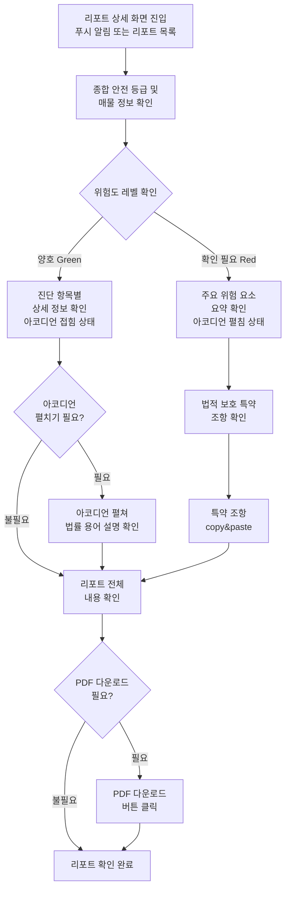

# PRD: 지킴진단 리포트 상세 화면

**⚠️ 중요: PRD 작성 전 반드시 확인하세요**
- 상위 PRD: `docs/PRD_지킴진단.md`를 먼저 읽고 참고하세요.
- PRD 작성 가이드라인: `docs/Template/PRD_GROUND_RULES.md`를 준수하세요.
- 핵심 원칙: **Logic over Tech** - 기술적 구현 상세가 아닌 비즈니스 로직과 정책 중심으로 작성합니다.

---

## 1. 개요 (Overview)

### 1.1 문서 정보

```
작성자: [Gina Chang]
작성일: 2024년 12월 13일
최종 수정일: 2024년 12월 13일
버전: 1.0
상위 PRD: PRD_지킴진단.md
```

---

### 1.2 제품/프로젝트 이름

```
대상 서비스명: 지킴진단
기능명: 지킴진단 리포트 상세 화면
설명: 사용자가 발급받은 지킴진단 종합 리포트를 확인하고, 매물의 계약 안정성에 대한 상세 진단 정보를 이해할 수 있는 화면
```

---

### 1.3 핵심 목표 (Goals)

**비즈니스 목표:**
- 사용자가 진단 리포트의 가치를 명확히 인지하도록 함
- 복잡한 법률 정보를 이해하기 쉽게 제공하여 서비스 신뢰도 향상
- 위험 요소 발견 시 법적 보호 특약 제공으로 계약 안정성 향상

**사용자 목표:**
- 발급받은 진단 리포트의 핵심 내용을 빠르게 파악
- 매물의 위험도와 안전성을 직관적으로 이해
- 복잡한 법률 용어를 쉽게 이해하고 필요한 조치를 취할 수 있도록 지원
- 위험 요소 발견 시 법적으로 보호받을 수 있는 특약 조항을 확인하고 활용

---

### 1.4 성공 지표 (KPIs)

**Success Metrics (성공 지표):**
- 리포트 상세 화면 체류 시간: 평균 [TBD]분 이상 (목표)
- 리포트 재확인율: 발급 후 7일 이내 재확인율 [TBD]% (목표)
- 특약 조항 활용율: 위험 요소 발견 시 특약 조항 확인율 [TBD]% (목표)
- PDF 다운로드율: 리포트 발급 건 대비 PDF 다운로드율 [TBD]% (목표)

**Guardrail Metrics (안전장치 지표):**
- 리포트 로딩 실패율: 목표 1% 이하
- 사용자 이탈률 (리포트 상세 화면 진입 후 10초 이내): 목표 20% 이하

**측정 방법:**
- Zams 대시보드
- 주간 리포트 자동 생성

---

## 2. 배경 및 문제 정의 (Context & Problem Definition)

### 2.1 배경/동기 (Motivation)

**상위 PRD 맥락:**
- 지킴진단 서비스는 사용자가 매물의 계약 안정성을 진단받는 유료 서비스입니다.
- 진단 리포트는 결제 완료 후 최대 20분 이내에 생성되며, 푸시 알림을 통해 사용자에게 안내됩니다.
- 사용자는 리포트 상세 화면에서 종합 진단 결과를 확인하고, 필요한 조치를 취할 수 있어야 합니다.

**사용자 니즈:**
- 복잡한 법률 정보를 전문가 없이도 이해하고 싶어함
- 매물의 위험도를 빠르게 파악하고 싶어함
- 위험 요소 발견 시 구체적인 대응 방안을 원함
- 리포트를 나중에 다시 확인하거나 공유하고 싶어함

---

### 2.2 사용자 및 페르소나 (User & Persona)

**주요 타겟 사용자:**
1. 진단 리포트를 발급받은 사용자: 리포트 내용을 확인하고 이해하고 싶은 사용자
2. 위험 요소가 발견된 사용자: 법적 보호 특약을 확인하고 활용하고 싶은 사용자
3. 리포트를 재확인하는 사용자: 이전에 발급받은 리포트를 다시 확인하고 싶은 사용자

**페르소나:**
- 링크: `docs/Template/PERSONA_TEMPLATE.md`
- 대표 페르소나: 김지현 (30대 후반, IT 기획자) - 전세사기 방지를 최우선으로 고려하는 독신 거주자

---

### 2.3 해결할 문제 (The Problem)

**핵심 문제:**
사용자가 발급받은 진단 리포트의 내용을 효과적으로 이해하고, 필요한 조치를 취하기 어려움

**문제 상세:**
- 복잡한 법률 용어와 전문 정보를 일반 사용자가 이해하기 어려움
- 리포트의 핵심 내용(위험도)을 빠르게 파악하기 어려움
- 위험 요소 발견 시 구체적인 대응 방안을 찾기 어려움
- 리포트를 나중에 다시 확인하거나 공유하기 어려움

**영향:**
- 사용자가 리포트의 가치를 제대로 인지하지 못함
- 위험 요소를 발견해도 적절한 조치를 취하지 못함
- 서비스에 대한 신뢰도 저하

---

### 2.4 현재 상태 (As-Is)

**현재 프로세스:**
1. 사용자가 진단 리포트를 발급받음
2. 리포트 상세 화면에 진입
3. 복잡한 정보를 직접 해석해야 함
4. 위험 요소 발견 시 대응 방안을 별도로 찾아야 함

**현재의 한계:**
- 리포트의 핵심 내용이 명확하게 강조되지 않음
- 법률 용어에 대한 설명이 부족함
- 위험도가 직관적으로 표현되지 않음
- 특약 조항이 명확하게 안내되지 않음

---

## 3. 솔루션 및 범위 (Solution & Scope)

### 3.1 솔루션 제안 (Proposed Solution)

**핵심 가치 제안:**
사용자가 발급받은 진단 리포트의 핵심 내용을 빠르게 파악하고, 복잡한 법률 정보를 쉽게 이해하며, 위험 요소 발견 시 법적 보호 특약을 활용할 수 있도록 지원합니다.

**주요 접근:**
- 리포트 상단에 종합 안전 등급과 매물 정보를 크게 강조하여 핵심 내용을 즉시 파악할 수 있도록 함
- 위험도 레벨을 2단계("양호" Green / "확인 필요" Red) tag로 명확하게 표시
- 복잡한 법률 용어를 진단 항목마다 개별 설명을 붙여 이해를 돕음 (예.여유금액이란? 여유금액 계산은 어떻게 하나요?)
- 위험 요소 발견 시 법적 보호 특약 조항을 명확하게 안내하고 활용할 수 있도록 지원
- PDF 다운로드 기능을 제공하여 리포트를 보관하고 공유할 수 있도록 함

**기대 효과:**
- 사용자가 리포트의 핵심 내용을 빠르게 파악할 수 있음
- 복잡한 법률 정보를 쉽게 이해할 수 있음
- 위험 요소 발견 시 적절한 조치를 취할 수 있음
- 리포트의 가치를 명확히 인지하여 서비스 신뢰도 향상

---

### 3.2 핵심 기능 (Key Features)

**핵심 기능 (우선순위 순):**

1. **종합 안전 등급 및 매물 정보 표시** - Must Have
   - 상세 페이지 타이틀 : 지킴 진단 리포트 
   - 리포트 최 상단 영역 매물 주소 노출와 해당 안전 등급을 예상할 수 있는 메타포 제공
   - 리포트 상단 - 표지 개념 : 영역에 리포트 요약 내용을 서술한 ai 로 생성된 한줄 요약 문구를 제공함 
   - 한줄 요약 아래 진단한 항목의 목록을 제공하며, 확인이 필요한 항목의 개수도 함께 표시
   - 모든 항목이 양호한 경우 : "주요 점검 모두 양호해요."
   - 1개 이상의 항목이 위험한 경우 : "확인이 필요한 항목이 있어요."  

2. **진단 항목별 상세 정보 표시 (아코디언 형식)** - Must Have
   - 진단 항목은 탭으로 구성하고 각 탭마다 항목별로 진단 요약 문장을 노출함
   - 각 탭 내의 진단 세부 항목은 아코디언 형식으로 구성
   - 양호한 항목: 아코디언이 접혀있는 상태로 리포트 상세 화면에 진입
   - 확인이 필요한 항목: 아코디언이 펼쳐있는 상태로 리포트 상세 화면에 진입
   - 아코디언을 펼치면 해당 항목의 법률 용어 설명과 결과 해석이 표시됨
    - 매물진단: 기본정보 (소재지, 주택유형, 계약유형 계약기간) 건축물대장 분석 (위반건축물), 권리관계분석 (대지권, 토지별도 등기, 가등기, 압류/가압류, 처분금자가처분, 신탁, 경매개시결정, 근저당권, 임차권등기명령, 전세권, 민간임대주택등록여부, 등기사항 변경예정) 항목별 아코디언
    -- 항목별 분석 결과로 양호/확인필요 테그가 붙고, 상세 정보 텍스트 노출됨 (있음/없음/해당안함 등)
    -- 아코디언 내부에 법률 용어 설명과 결과 해석 포함
    - 소유자(집주인) 진단: 소유자 정보 (소유구분, 소유자) 소유주 상세 분석 (토지/건물 소유자 일치 여부, 임대사업자 여부, 보증금미반환이력) 항목별 아코디언
    -- 항목별 분석 결과로 양호/확인필요 테그가 붙고, 상세 정보 텍스트 노출됨 (있음/없음/해당안함 등)
    -- 아코디언 내부에 법률 용어 설명과 결과 해석 포함
    - 시세 진단: 시세 대비 전세금 비율, 전세가율 분석, 기존 채무금액, 여유금액, 최우선 변제권, 건물 등기부등본/ 토지 등기부등본 열람 버튼 제공 
    - 대출/보험 진단: 보증보험 가입 가능 여부
    -- 가능성 높음/ 낮음으로 판단
    - 범죄/치안: CCTV 등 보안 시설, 범죄발생율, 유흥업소
    - 생활/편의: 편의시설 분포, 정주여건 비교
    - 특약 : 특약에 대한 간단한 안내 및 추천 특약 항목 제공 (복사하기 가능) 
  - 위험도 레벨 2단계 표시 ("양호" Green / "확인 필요" Red)

3. **법률 용어 설명 제공 (아코디언 내부)** - Must Have
   - 복잡한 법률 용어는 각 진단 항목의 아코디언 내부에 설명을 제공
   - 아코디언을 펼치면 해당 항목의 법률 용어 설명과 결과 해석이 표시됨
   - 양호한 항목은 접혀있어 필요시에만 펼쳐서 확인 가능
   - 확인이 필요한 항목은 펼쳐진 상태로 진입하여 바로 확인 가능
   - 예: "근저당", "전세가율", "전세보증보험", "압류/가압류" 등

4. **법적 보호 특약 조항 제공** - Must Have
   - 진단 항목과 동등레벨의 탭으로 구성 
   - 위험 요소 발견 시 해당 상황에 맞는 특약 조항 표시
   - 특약 조항의 내용과 효과를 명확히 설명
   - 특약 조항을 클릭하여 copy&paste 할 수 있도록 지원
   - 계약서에 특약을 포함하는 방법 안내

5. **PDF 다운로드 기능** - Should Have
   - 리포트 상단에 PDF 다운로드 버튼 제공
   - 버튼 클릭 시 리포트 전체 내용을 PDF로 생성
   - 생성된 PDF를 파일함에 저장

6. **리포트 공유 기능** - Nice to Have
   - 리포트를 다른 사용자와 공유할 수 있는 기능
   - 공유 링크 생성 또는 이미지 공유

---

### 3.3 범위 (In-Scope)

**포함 범위:**

**기능:**
- 종합 안전 등급 및 매물 정보 표시 (MVP)
- 진단 항목별 상세 정보 표시 (MVP)
- 법률 용어 툴팁 제공 (MVP)
- 법적 보호 특약 조항 제공 (MVP)
- PDF 다운로드 기능 (Phase 1)
- 리포트 공유 기능 (Phase 2)

**플랫폼:**
- Mobile app
- Web

**지역/언어:**
- 한국어 (대한민국)

**개발 단계:**
- MVP: 종합 안전 등급, 진단 항목별 정보, 법률 용어 툴팁, 특약 조항
- Phase 1: PDF 다운로드
- Phase 2: 리포트 공유

---

### 3.4 제외 범위 (Out-of-Scope)

**제외 범위:**

**기능:**
- 리포트 수정 기능 (리포트는 생성 후 수정 불가)
- 리포트 삭제 기능 (리포트는 영구 보관)
- 리포트 인쇄 기능 (PDF 다운로드로 대체)

**플랫폼:**

---

## 4. 상세 요구사항 (Detailed Requirements)

### 4.1 사용자 스토리 (User Stories)

**우선순위: Must Have**

#### 1. 리포트 핵심 내용 파악 - 안전한 집 리포트 (Report Summary View - Safe Property)

**사용자 스토리:**
**신중한 1인 가구 김미래(28세)**는 안전한 집의 리포트를 받았을 때, 리포트 상세 화면에 진입하여 매물의 종합 안전 등급이 양호함을 즉시 파악할 수 있다.

**수용 기준 (Acceptance Criteria):**
1. 리포트 상세 화면 진입 시, 상세 페이지 타이틀 "지킴 진단 리포트"가 표시되어야 한다.
2. 리포트 최 상단 영역에 매물 주소와 해당 안전 등급을 예상할 수 있는 메타포가 표시되어야 한다.
3. 리포트 상단 표지 개념 영역에 AI로 생성된 한줄 요약 문구가 제공되어야 한다.
4. 한줄 요약 아래 진단한 항목의 목록과 확인이 필요한 항목의 개수가 함께 표시되어야 한다.
5. 모든 항목이 양호한 경우: "주요 점검 모두 양호해요." 메시지가 표시되어야 한다.
6. 1개 이상의 항목이 위험한 경우: "확인이 필요한 항목이 있어요." 메시지가 표시되어야 한다.
7. 각 진단 항목별로 위험도 레벨이 tag로 표시되어야 한다 ("양호" Green / "확인 필요" Red).

---

#### 2. 진단 항목별 상세 정보 확인 - 위험한 집 리포트 (Detailed Diagnosis View - Risky Property)

**사용자 스토리:**
**안전 우선 주거 이전자 박지훈(35세)**는 위험한 집, 확인해야 할 사항이 많은 집의 리포트를 받았을 때, 리포트에서 각 진단 항목별 상세 정보를 확인하고 위험 요소를 파악할 수 있다.

**수용 기준 (Acceptance Criteria):**
1. 진단 항목은 탭으로 구성되어야 하며, 각 탭마다 항목별 진단 요약 문장이 노출되어야 한다.
2. 각 탭 내의 진단 세부 항목은 아코디언 형식으로 구성되어야 한다.
3. 아코디언 형식의 각 세부 항목에는 다음이 포함되어야 한다:
   - 항목명과 위험도 레벨 tag ("양호" Green / "확인 필요" Red)
   - 항목을 클릭하면 펼쳐지는 상세 정보 (법률 용어 설명 및 결과 해석)
4. 양호한 항목은 아코디언이 접혀있는 상태로 리포트 상세 화면에 진입해야 한다.
5. 확인이 필요한 항목은 아코디언이 펼쳐있는 상태로 리포트 상세 화면에 진입해야 한다.
6. 매물진단 탭: 기본정보(소재지, 주택유형, 계약유형, 계약기간), 건축물대장 분석(위반건축물), 권리관계분석(대지권, 토지별도 등기, 가등기, 압류/가압류, 처분금지가처분, 신탁, 경매개시결정, 근저당권, 임차권등기명령, 전세권, 민간임대주택등록여부, 등기사항 변경예정) 항목별 아코디언으로 구성
7. 소유자(집주인) 진단 탭: 소유자 정보(소유구분, 소유자), 소유주 상세 분석(토지/건물 소유자 일치 여부, 임대사업자 여부, 보증금미반환이력) 항목별 아코디언으로 구성
8. 시세 진단 탭: 시세 대비 전세금 비율, 전세가율 분석, 기존 채무금액, 여유금액, 최우선 변제권, 건물 등기부등본/토지 등기부등본 열람 버튼이 제공되어야 한다.
9. 대출/보험 진단 탭: 보증보험 가입 가능 여부가 가능성 높음/낮음으로 판단되어 표시되어야 한다.
10. 범죄/치안 탭: CCTV 등 보안 시설, 범죄발생율, 유흥업소 정보가 표시되어야 한다.
11. 생활/편의 탭: 편의시설 분포, 정주여건 비교 정보가 표시되어야 한다.
12. 특약 탭: 특약에 대한 간단한 안내 및 추천 특약 항목이 제공되어야 하며, 복사하기가 가능해야 한다.
13. 각 항목별 분석 결과로 양호/확인필요 tag가 붙고, 상세 정보 텍스트(있음/없음/해당안함 등)가 노출되어야 한다.
14. 아코디언을 펼치면 해당 항목의 법률 용어 설명과 결과 해석이 표시되어야 한다.

---

#### 3. 법률 용어 이해 (Legal Term Explanation)

**사용자 스토리:**
**신중한 1인 가구 김미래(28세)**는 안전한 집의 리포트를 받았을 때, 필요시 아코디언을 펼쳐 각 진단 항목의 법률 용어 설명을 확인할 수 있다.

**안전 우선 주거 이전자 박지훈(35세)**는 위험한 집의 리포트를 받았을 때, 확인이 필요한 항목의 아코디언이 이미 펼쳐진 상태에서 법률 용어 설명과 결과 해석을 바로 확인할 수 있다.

**수용 기준 (Acceptance Criteria):**
1. 복잡한 법률 용어는 각 진단 항목의 아코디언 내부에 설명을 제공해야 한다.
2. 아코디언을 펼치면 해당 항목의 법률 용어 설명과 결과 해석이 표시되어야 한다.
3. 설명은 전문가가 아닌 일반 사용자도 이해할 수 있는 쉬운 언어로 작성되어야 한다.
4. 설명에는 예시나 비유를 포함하여 이해를 돕는다.
5. 주요 법률 용어 예시: "근저당", "전세가율", "전세보증보험", "압류/가압류", "경매개시결정", "임차권등기명령", "여유금액" 등
6. 설명은 "여유금액이란?", "여유금액 계산은 어떻게 하나요?"와 같이 질문 형식으로도 제공될 수 있다.
7. 양호한 항목의 아코디언은 접혀있어 필요시에만 펼쳐서 법률 용어 설명을 확인할 수 있어야 한다.
8. 확인이 필요한 항목의 아코디언은 펼쳐진 상태로 진입하여 법률 용어 설명과 결과 해석을 바로 확인할 수 있어야 한다.

---

#### 4. 법적 보호 특약 조항 확인 및 활용 (Legal Protection Clause)

**사용자 스토리:**
**안전 우선 주거 이전자 박지훈(35세)**는 위험 요소가 발견된 경우, 법적으로 보호받을 수 있는 특약 조항을 확인하고 계약서에 포함할 수 있다.

**수용 기준 (Acceptance Criteria):**
1. 특약은 진단 항목과 동등 레벨의 탭으로 구성되어야 한다.
2. 위험 요소가 발견된 경우, 해당 상황에 맞는 특약 조항이 표시되어야 한다.
3. 특약 조항의 내용과 효과를 명확히 설명하는 화면이 제공되어야 한다.
4. 특약 조항을 클릭하여 copy&paste 할 수 있어야 한다.
5. 계약서에 특약을 포함하는 방법을 안내해야 한다.
6. 특약 조항은 법적 검토를 거친 유효한 조항이어야 한다.

---

**우선순위: Should Have**

#### 5. 리포트 PDF 다운로드 (Report PDF Download)

**사용자 스토리:**
**신중한 1인 가구 김미래(28세)**는 리포트를 PDF로 다운로드하여 보관하거나 공유할 수 있다.

**수용 기준 (Acceptance Criteria):**
1. 리포트 상단에 PDF 다운로드 버튼이 제공되어야 한다.
2. 버튼 클릭 시 리포트 전체 내용이 PDF로 생성되어야 한다.
3. 생성된 PDF를 파일함에 저장할 수 있어야 한다.
4. PDF에는 리포트의 모든 내용이 포함되어야 한다.

---

### 4.2 기능 요구사항 (Functional Requirements)

**기능: 리포트 상세 화면 표시**

**사용자 입력:**
- 리포트 상세 화면 진입 (푸시 알림 클릭 또는 리포트 목록에서 선택)

**시스템 동작:**
1. 사용자가 리포트 상세 화면에 진입하면, 리포트 데이터를 불러온다.
2. 상세 페이지 타이틀 "지킴 진단 리포트"를 표시한다.
3. 리포트 최 상단 영역에 매물 주소와 해당 안전 등급을 예상할 수 있는 메타포를 표시한다.
4. 리포트 상단 표지 개념 영역에 AI로 생성된 한줄 요약 문구를 제공한다.
5. 한줄 요약 아래 진단한 항목의 목록과 확인이 필요한 항목의 개수를 함께 표시한다.
6. 모든 항목이 양호한 경우: "주요 점검 모두 양호해요." 메시지를 표시한다.
7. 1개 이상의 항목이 위험한 경우: "확인이 필요한 항목이 있어요." 메시지를 표시한다.
8. 진단 항목을 탭으로 구성하고, 각 탭마다 항목별 진단 요약 문장을 노출한다.
9. 각 탭 내의 진단 세부 항목을 아코디언 형식으로 구성한다.
10. 각 아코디언 항목에 항목명과 위험도 레벨 tag를 표시한다 ("양호" Green / "확인 필요" Red).
11. 양호한 항목의 아코디언은 접혀있는 상태로 초기 표시한다.
12. 확인이 필요한 항목의 아코디언은 펼쳐있는 상태로 초기 표시한다.
13. 아코디언을 펼치면 해당 항목의 법률 용어 설명과 결과 해석을 표시한다.
14. 각 항목별 분석 결과로 양호/확인필요 tag를 붙이고, 상세 정보 텍스트(있음/없음/해당안함 등)를 노출한다.
15. 특약을 진단 항목과 동등 레벨의 탭으로 구성하고, 위험 요소 발견 시 특약 조항을 표시한다.
16. 리포트 상단에 PDF 다운로드 버튼을 제공한다.

**결과:**
- 리포트 표시 성공 시: 리포트 상세 화면에 모든 정보가 표시된다.
- 리포트 표시 실패 시: "리포트를 불러올 수 없습니다. 다시 시도해주세요." 메시지를 표시한다.

**비즈니스 규칙:**
- 리포트는 구매한 사용자만 확인할 수 있다.
- 리포트는 영구적으로 접근 가능해야 한다.
- 진단 매물이 직방에서 삭제되었더라도, 발급받은 리포트는 접근 가능해야 한다.
- 리포트 내용은 생성 시점의 데이터를 기준으로 하며, 이후 변경사항은 반영되지 않는다.

**우선순위: Must Have**

---

**기능: 법률 용어 설명 제공 (아코디언 내부)**

**사용자 입력:**
- 아코디언 항목 클릭하여 펼치기
- 이미 펼쳐진 확인 필요 항목의 내용 확인

**시스템 동작:**
1. 각 진단 항목의 세부 항목을 아코디언 형식으로 구성한다.
2. 양호한 항목의 아코디언은 접혀있는 상태로 초기 표시한다.
3. 확인이 필요한 항목의 아코디언은 펼쳐있는 상태로 초기 표시한다.
4. 아코디언을 펼치면 해당 항목의 법률 용어 설명과 결과 해석을 표시한다.
5. 설명은 전문가가 아닌 일반 사용자도 이해할 수 있는 쉬운 언어로 작성되어야 한다.
6. 설명에는 예시나 비유를 포함하여 이해를 돕는다.
7. 설명은 "여유금액이란?", "여유금액 계산은 어떻게 하나요?"와 같이 질문 형식으로도 제공될 수 있다.

**결과:**
- 설명 제공 성공 시: 각 진단 항목에서 법률 용어에 대한 설명이 바로 표시된다.
- 설명 제공 실패 시: 기본 동작을 수행한다 (에러 메시지 표시 없음).

**비즈니스 규칙:**
- 주요 법률 용어에 대해서는 반드시 설명을 제공해야 한다.
- 법률 용어 설명은 지킴진단 CMS를 통해 법무팀에서 운영/관리한다.
- 법률 용어 설명은 정기적으로 업데이트되어 최신 정보를 제공해야 한다.

**우선순위: Must Have**

---

**기능: 법적 보호 특약 조항 표시 및 활용**

**사용자 입력:**
- 특약 조항 확인
- 특약 조항 copy&paste 요청

**시스템 동작:**
1. 특약을 진단 항목과 동등 레벨의 탭으로 구성한다.
2. 위험 요소가 발견된 경우, 해당 상황에 맞는 특약 조항을 표시한다.
3. 특약 조항의 내용과 효과를 명확히 설명한다.
4. 사용자가 특약 조항을 클릭하면, 특약 조항 텍스트를 copy할 수 있도록 지원한다.
5. 계약서에 특약을 포함하는 방법을 안내한다.

**결과:**
- 특약 제공 성공 시: 특약 조항이 리포트에 포함되어 표시된다.
- 특약 미제공 시: 위험 요소가 없는 경우 특약 조항은 표시되지 않는다.

**비즈니스 규칙:**
- 진단 결과에 따라 필요시에만 특약을 표시한다.
- 특약은 법적으로 유효하고 계약 안정성을 높이는 조항이어야 한다.
- 특약 조항은 사용자가 계약서에 포함할 수 있는 형태로 제공한다.
- 특약 조항은 지킴진단 CMS를 통해 법무팀에서 운영/관리한다.
- 특약 제공 시 법적 검토를 거친 조항만 제공한다.

**우선순위: Must Have**

---

**기능: 리포트 PDF 다운로드**

**사용자 입력:**
- PDF 다운로드 버튼 클릭

**시스템 동작:**
1. 사용자가 PDF 다운로드 버튼을 클릭하면, 리포트 전체 내용을 PDF로 생성한다.
2. 생성된 PDF를 파일함에 저장할 수 있도록 한다.
3. PDF에는 리포트의 모든 내용이 포함되어야 한다.

**결과:**
- PDF 다운로드 성공 시: 리포트 전체 내용이 PDF로 생성되어 파일함에 저장된다.
- PDF 다운로드 실패 시: "PDF 다운로드에 실패했습니다. 다시 시도해주세요." 메시지를 표시한다.

**비즈니스 규칙:**
- PDF에는 리포트의 모든 내용이 포함되어야 한다.
- PDF 파일명은 "지킴진단_매물주소_발급일자.pdf" 형식으로 생성한다.
- PDF는 모바일과 웹 모두에서 다운로드 가능해야 한다.

**우선순위: Should Have**

---

### 4.3 비기능 요구사항 (Non-Functional Requirements)

**성능:**
- 리포트 상세 화면 로딩 시간: 3초 이내
- PDF 생성 시간: 10초 이내

**보안:**
- 리포트는 구매한 사용자만 확인할 수 있어야 한다.
- 리포트 데이터는 안전하게 보관되어야 한다.

**접근성:**
- 모바일과 웹 모두에서 일관된 경험 제공
- 스크린 리더 지원 (Phase 2)

---

### 4.4 주요 시나리오 플로우 (Key Scenario Flows)

#### 4.4.1 시나리오 목록 및 목표

1. **리포트 상세 화면 진입 및 핵심 내용 파악**
   - 목표: 사용자가 리포트 상세 화면에 진입하여 핵심 내용을 빠르게 파악할 수 있도록 함
   - 우선순위: Must Have

2. **진단 항목별 상세 정보 확인 (아코디언 형식)**
   - 목표: 사용자가 각 진단 항목별 상세 정보를 아코디언 형식으로 확인하고 위험도를 파악할 수 있도록 함
   - 양호한 항목은 접혀있고, 확인이 필요한 항목은 펼쳐있는 상태로 진입
   - 우선순위: Must Have

3. **법률 용어 설명 확인 (아코디언 내부)**
   - 목표: 사용자가 아코디언을 펼쳐 복잡한 법률 용어 설명과 결과 해석을 확인할 수 있도록 함
   - 확인이 필요한 항목은 이미 펼쳐진 상태에서 바로 확인 가능
   - 우선순위: Must Have

4. **법적 보호 특약 조항 확인 및 활용**
   - 목표: 사용자가 위험 요소 발견 시 법적 보호 특약 조항을 확인하고 활용할 수 있도록 함
   - 우선순위: Must Have

---

#### 4.4.2 플로우 다이어그램/링크

**리포트 상세 화면 사용자 플로우**



---

#### 4.4.3 사용자 플로우 상세

**1. 리포트 상세 화면 진입**
- 사용자 행동: 푸시 알림 클릭 또는 리포트 목록에서 리포트 선택
- 시스템 반응 / 주요 화면: 
  * 리포트 상세 화면에 진입하며, 매물 주소와 종합 안전 등급이 상단에 크게 강조되어 표시됨
  * 양호한 항목의 아코디언은 접혀있는 상태로 표시됨
  * 확인이 필요한 항목의 아코디언은 펼쳐있는 상태로 표시됨

**2. 종합 안전 등급 및 리포트 요약 확인**
- 사용자 행동: 리포트 상단의 종합 안전 등급 및 AI 생성 한줄 요약 확인
- 시스템 반응 / 주요 화면: 
  * 리포트 최 상단 영역에 매물 주소와 안전 등급 메타포 표시
  * AI 생성 한줄 요약 문구 표시
  * 진단 항목 목록과 확인 필요 항목 개수 표시
  * 모든 항목 양호 시: "주요 점검 모두 양호해요."
  * 1개 이상 위험 시: "확인이 필요한 항목이 있어요."

**3. 진단 항목별 상세 정보 확인 (탭 및 아코디언 구성)**
- 사용자 행동: 각 진단 항목 탭을 선택하여 상세 정보 확인, 필요시 아코디언을 펼쳐 상세 내용 확인
- 시스템 반응 / 주요 화면: 
  * 진단 항목별 탭으로 구성
  * 각 탭마다 진단 요약 문장 노출
  * 각 탭 내의 진단 세부 항목을 아코디언 형식으로 구성
  * 양호한 항목의 아코디언은 접혀있는 상태로 표시
  * 확인이 필요한 항목의 아코디언은 펼쳐있는 상태로 표시
  * 아코디언을 펼치면 법률 용어 설명과 결과 해석 표시
  * 각 항목별 분석 결과로 양호/확인필요 tag 표시
  * 상세 정보 텍스트(있음/없음/해당안함 등) 노출

**4. 아코디언을 통한 법률 용어 설명 확인**
- 사용자 행동 (안전한 집 리포트): 양호한 항목의 아코디언을 펼쳐 상세 내용 확인
- 사용자 행동 (위험한 집 리포트): 이미 펼쳐진 확인 필요 항목의 법률 용어 설명과 결과 해석 확인
- 시스템 반응 / 주요 화면: 
  * 아코디언을 펼치면 해당 항목의 법률 용어 설명과 결과 해석이 표시됨
  * 설명은 전문가가 아닌 일반 사용자도 이해할 수 있는 쉬운 언어로 제공됨

**5. 특약 조항 확인 (탭 구성)**
- 사용자 행동: 특약 탭을 선택하여 특약 조항 확인
- 시스템 반응 / 주요 화면: 
  * 특약을 진단 항목과 동등 레벨의 탭으로 구성
  * 특약 조항의 내용과 효과 설명
  * 특약 조항 copy&paste 가능

**5. 법적 보호 특약 조항 확인 및 활용**
- 사용자 행동: 위험 요소 발견 시 특약 조항 섹션 확인 및 특약 조항 클릭
- 시스템 반응 / 주요 화면: 특약 조항의 내용과 효과 설명, 특약 조항 텍스트 copy 가능

**6. PDF 다운로드**
- 사용자 행동: PDF 다운로드 버튼 클릭
- 시스템 반응 / 주요 화면: 리포트 전체 내용이 PDF로 생성되어 파일함에 저장

---

#### 4.4.4 예외 및 에러 처리

**단계: 리포트 상세 화면 진입**
- 예외 상황: 리포트 데이터를 불러올 수 없음
  - 사용자 메시지: "리포트를 불러올 수 없습니다. 다시 시도해주세요."
  - 처리 방식: 재시도 버튼 제공, 네트워크 연결 확인 안내

**단계: 아코디언 표시 및 법률 용어 설명 제공**
- 예외 상황: 아코디언 상태 정보 또는 법률 용어 설명 데이터를 불러올 수 없음
  - 사용자 메시지: 기본 동작 수행 (에러 메시지 표시 없음)
  - 처리 방식: 
    * 아코디언 상태 정보가 없는 경우, 모든 항목을 접힌 상태로 표시
    * 설명 제공 실패 시에도 리포트는 정상적으로 표시

**단계: PDF 다운로드**
- 예외 상황: PDF 생성 실패
  - 사용자 메시지: "PDF 다운로드에 실패했습니다. 다시 시도해주세요."
  - 처리 방식: 재시도 버튼 제공

---

#### 4.4.5 화면 전환 및 인터랙션

**화면: 리포트 목록 → 리포트 상세 화면**
- 전환 방식: 리포트 목록에서 특정 리포트를 선택하면 리포트 상세 화면으로 이동
- 인터랙션: 리포트 상세 화면에는 뒤로가기 버튼이 표시되어 이전 화면으로 돌아갈 수 있음

**화면: 푸시 알림 → 리포트 상세 화면**
- 전환 방식: 리포트 생성 완료 푸시 알림을 클릭하면 바로 리포트 상세 화면으로 진입
- 인터랙션: 리포트 상세 화면에는 뒤로가기 버튼이 표시되어 이전 화면으로 돌아갈 수 있음

**화면 내 인터랙션:**
- 스크롤: 리포트는 긴 형태의 스크롤 가능한 레이아웃
- 탭 메뉴: 진단 항목별로 탭 메뉴를 제공하여 각 항목을 쉽게 확인할 수 있음 (매물진단, 집주인 진단, 시세 진단, 대출/보험 진단, 범죄/치안, 생활/편의, 특약)
- 아코디언: 각 탭 내의 진단 세부 항목은 아코디언 형식으로 구성되며, 클릭하여 펼치거나 접을 수 있음
  * 양호한 항목: 아코디언이 접혀있는 상태로 초기 표시, 필요시 펼쳐서 상세 내용 확인 가능
  * 확인이 필요한 항목: 아코디언이 펼쳐있는 상태로 초기 표시, 법률 용어 설명과 결과 해석을 바로 확인 가능
- 법률 용어 설명: 아코디언을 펼치면 해당 항목의 법률 용어 설명과 결과 해석이 표시됨
- 특약 조항: 특약 조항을 클릭하면 텍스트를 copy할 수 있음

---

### 4.5 디자인/UX 요구사항

**디자인 목표:**
- 신뢰감을 주는 전문적인 인터페이스
- 복잡한 정보를 이해하기 쉽게 시각화
- 안전성과 신뢰성을 강조하는 디자인
- 직관적이고 사용하기 쉬운 인터페이스

**디자인 시스템:**
- 링크: [ZUIX 2.0](https://www.figma.com/design/4ZDxigMgcTwzJmNlrmY0iq/ZUIX-2.0?m=auto&t=YCrqYD4ySFnpuv4W-6)
- 주요 컴포넌트: [TBD - 컴포넌트 라이브러리 링크]

**주요 화면:**
- 리포트 상세 화면: [Figma 링크](https://www.figma.com/design/PGKrfGY5NkSfgwVSjOTk0Z/%EC%A7%80%ED%82%B4%EC%A7%84%EB%8B%A8?node-id=1187-2481&t=yLylXls7ESHXmZCr-11)

**디자인 요소:**
- 색상: 안전성과 신뢰성을 나타내는 색상 팔레트 (color style : green)
  - 위험도 레벨: "양호" Green / "확인 필요" Red
- 타이포그래피: 가독성이 높은 폰트 사용
- 간격: 정보의 계층 구조를 명확히 하는 스페이싱

**위험도 레벨 표시:**
- 안전한 등급: "양호" (Green 컬러)
- 위험한 등급: "확인 필요" (Red 컬러)

---

### 4.6 기술/데이터 요구사항

**필요한 데이터:**
- 리포트 데이터: 종합 안전 등급, 진단 항목별 상세 정보, 위험도 레벨, AI 생성 한줄 요약
- 매물 정보: 주소, 매물 유형, 전세/월세 구분
- 진단 항목별 상세 데이터:
  * 매물진단: 기본정보, 건축물대장 분석, 권리관계분석 항목별 데이터
  * 소유자 진단: 소유자 정보, 소유주 상세 분석 항목별 데이터
  * 시세 진단: 시세 대비 전세금 비율, 전세가율, 기존 채무금액, 여유금액, 최우선 변제권 데이터
  * 대출/보험 진단: 보증보험 가입 가능 여부 데이터
  * 범죄/치안: CCTV, 범죄발생율, 유흥업소 데이터
  * 생활/편의: 편의시설 분포, 정주여건 비교 데이터
- 아코디언 상태 정보: 각 세부 항목별 양호/확인필요 여부 및 초기 펼침/접힘 상태
- 법률 용어 설명: 각 진단 항목별 아코디언 내부에 제공되는 법률 용어 설명 및 결과 해석 데이터
- 특약 조항: 위험 요소별 특약 조항 데이터

**데이터 수집 및 관리:**
- 리포트 데이터는 리포트 생성 시점의 데이터를 기준으로 함
- AI 생성 한줄 요약은 리포트 생성 시 자동 생성
- 법률 용어 설명은 지킴진단 CMS를 통해 법무팀에서 운영/관리
- 특약 조항은 지킴진단 CMS를 통해 법무팀에서 운영/관리
- 데이터는 정기적으로 업데이트되어 최신 정보를 제공

**외부 연동:**
- 리포트 데이터: 지킴진단 백엔드 시스템
- AI 한줄 요약: AI 서비스 연동
- 법률 용어 설명: 지킴진단 CMS
- 특약 조항: 지킴진단 CMS

---

## 5. 출시 및 후속 계획 (Launch & Post-Launch)

### 5.1 예상 출시 일정

**마일스톤:**
- 기획 완료: [TBD]
- 디자인 완료: [TBD]
- 개발 시작: [TBD]
- 베타 테스트: [TBD]
- MVP 출시: [TBD]

**단계별 출시:**
- MVP: 종합 안전 등급, 진단 항목별 정보, 법률 용어 툴팁, 특약 조항 - [TBD]
- Phase 1: PDF 다운로드 - [TBD]
- Phase 2: 리포트 공유 - [TBD]

---

### 5.2 측정 및 분석 계획

**분석 툴:**
- Zams 대시보드: [TBD - 대시보드 링크]

**측정 지표 (1.4 참조):**
- 리포트 상세 화면 체류 시간: Zams 대시보드에서 일일 측정
- 리포트 재확인율: Zams 대시보드에서 주간 측정
- 특약 조항 활용율: Zams 대시보드에서 주간 측정
- PDF 다운로드율: Zams 대시보드에서 주간 측정

**리포트:**
- 일일 리포트: 자동 생성 및 이메일 발송
- 주간 리포트: 매주 월요일 생성
- 월간 리포트: 매월 첫째 주 생성

**알림 설정:**
- 리포트 로딩 실패율 1% 초과 시 즉시 알림
- 사용자 이탈률 (리포트 상세 화면 진입 후 10초 이내) 20% 초과 시 주간 알림

---

### 5.3 잠재적 리스크

**주요 리스크 및 대처 방안:**

1. **리포트 로딩 성능 리스크**
   - 리스크: 리포트 데이터가 많아 로딩 시간이 길어질 수 있음
   - 영향도: 높음
   - 대처 방안: 리포트 데이터를 효율적으로 로딩하고, 로딩 중 상태를 명확히 표시

2. **법률 용어 설명 정확성 리스크**
   - 리스크: 각 진단 항목마다 제공되는 법률 용어 설명이 부정확하거나 오해의 소지가 있을 수 있음
   - 영향도: 높음
   - 대처 방안: 법무팀의 정기적인 검토 및 업데이트 프로세스 도입, 각 진단 항목별 설명의 일관성 유지

3. **특약 조항 유효성 리스크**
   - 리스크: 특약 조항이 법적으로 유효하지 않을 수 있음
   - 영향도: 높음
   - 대처 방안: 법적 검토를 거친 조항만 제공하고, 정기적으로 업데이트

---

## 참고사항

### 관련 문서
- 상위 PRD: `docs/PRD_지킴진단.md`
- PRD 작성 가이드라인: `docs/Template/PRD_GROUND_RULES.md`
- 페르소나 템플릿: `docs/Template/PERSONA_TEMPLATE.md`
- 와이어프레임 리뷰: `Design/wireframes/와이어프레임_리뷰_결과.md`

---

**문서 버전**: 1.0  
**최종 수정일**: 2024년 12월 13일

