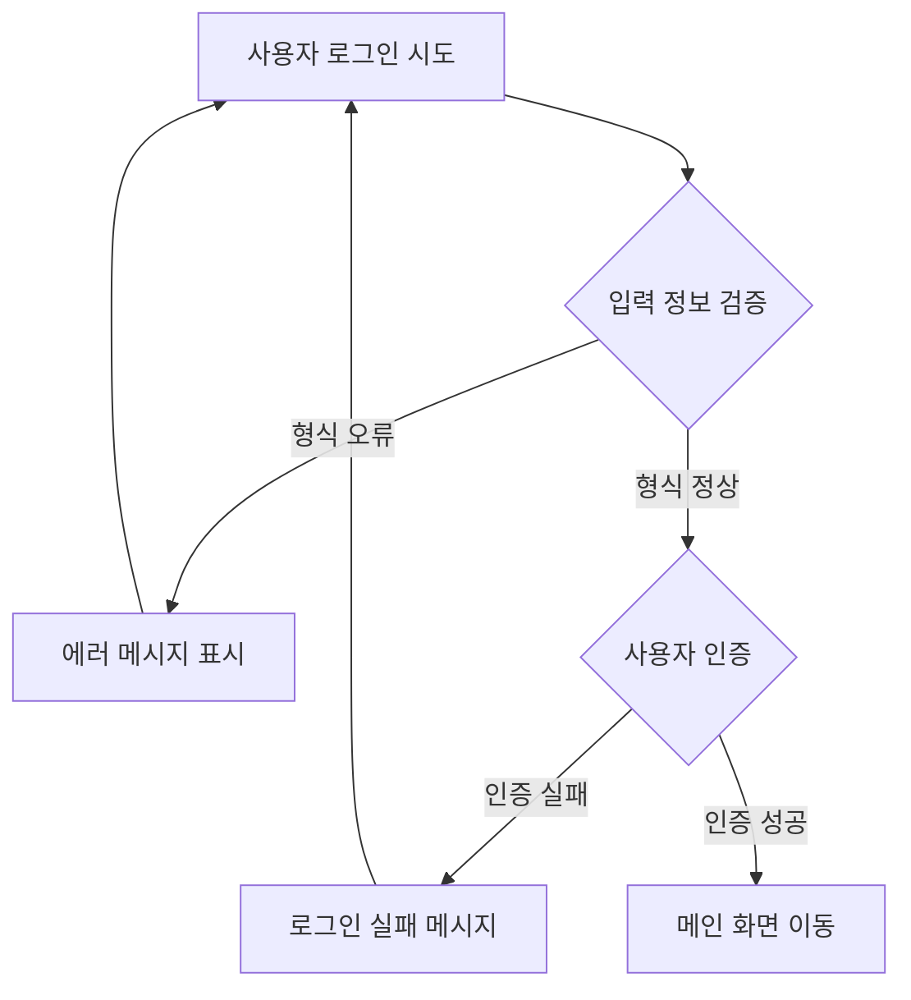

# PRD 표준 문서 양식 (Product Requirements Document Template)

## 개요
이 문서는 제품 요구사항 문서(PRD) 작성을 위한 표준 양식입니다. 각 섹션의 구조와 목적을 명확히 정의하여 일관된 문서 작성을 지원합니다.

**⚠️ 중요: PRD 작성 전 반드시 확인하세요**
- PRD 작성 가이드라인: `docs/Template/PRD_GROUND_RULES.md`를 먼저 읽고 준수하세요.
- 핵심 원칙: **Logic over Tech** - 기술적 구현 상세가 아닌 비즈니스 로직과 정책 중심으로 작성합니다.

---

## 문서 구조

### 1. 개요 (Overview)
**목적**: 문서의 기본 정보, 맥락, 목표를 정의

#### 1.1 문서 정보
**목적**: 작성자, 작성일, 최종 수정일, 버전(Version)

**작성 가이드**:
- 문서 작성자 및 담당자 정보
- 작성일 및 최종 수정일
- 문서 버전 관리 (예: v1.0, v1.1)

**예시**:
```
작성자: [이름/팀명]
작성일: 2024년 X월 X일
최종 수정일: 2024년 X월 X일
버전: 1.0
```

---

#### 1.2 제품/프로젝트 이름
**목적**: PRD가 다루는 제품, 기능, 프로젝트의 명확한 이름

**작성 가이드**:
- 대상 서비스명 또는 기능의 공식 명칭
- 간단한 한 줄 설명

**예시**:
```
대상 서비스명: [서비스명]
기능명: [기능명]
설명: [한 줄 요약]
```

---

### 2. 배경 및 문제 정의 (Context & Problem Definition)
**목적**: '왜' 이 개발이 필요한지 설명

**작성 가이드**:
- 2-Pager 문서에서 상세 내용을 확인하세요.
- 핵심 목표, 성공 지표, 배경/동기, 사용자 및 페르소나, 해결할 문제, 현재 상태, 솔루션 제안에 대한 상세 내용은 모두 2-Pager 문서에 포함되어 있습니다.

**예시**:
```
이 섹션의 상세 내용은 2-Pager 문서를 참조하세요:
- 링크: [2-Pager 문서 링크 또는 파일 경로]

2-Pager 문서에는 다음 내용이 포함됩니다:
- 핵심 목표 (Goals)
- 성공 지표 (KPIs)
- 배경/동기 (Motivation)
- 사용자 및 페르소나 (User & Persona)
- 해결할 문제 (The Problem)
- 현재 상태 (As-Is)
- 솔루션 제안 (Proposed Solution)
```

---

### 3. 솔루션 및 범위 (Solution & Scope)
**목적**: '무엇'을 만들 것인지 정의

#### 3.1 솔루션 제안 (Proposed Solution)
**목적**: 정의된 문제를 어떻게 해결할 것인지에 대한 상위 수준의 설명

**작성 가이드**:
- 핵심 가치 제안 (Value Proposition)
- 솔루션의 주요 접근 방식
- 기대 효과

**예시**:
```
핵심 가치 제안:
[문제]를 해결하기 위해 [솔루션]을 제공하여 [기대 효과]를 달성합니다.

주요 접근:
- [접근 방식 1]: [설명]
- [접근 방식 2]: [설명]
- [접근 방식 3]: [설명]

기대 효과:
- 사용자 작업 시간 50% 단축
- 사용자 만족도 향상
- 비즈니스 목표 달성
```

---

#### 3.2 핵심 기능 (Key Features)
**목적**: 솔루션을 구성하는 주요 기능을 리스트업

**작성 가이드**:
- 핵심 기능을 우선순위별로 나열
- 각 기능의 간단한 설명
- 기능 간의 관계 또는 의존성 (있는 경우)

**예시**:
```
핵심 기능 (우선순위 순):

1. [기능 A] - Must Have
   - [기능 설명]
   
2. [기능 B] - Must Have
   - [기능 설명]
   
3. [기능 C] - Should Have
   - [기능 설명]
   
4. [기능 D] - Nice to Have
   - [기능 설명]
```

---

#### 3.3 범위 (In-Scope)
**목적**: 이번 개발 범위에 포함되는 항목

**작성 가이드**:
- 구현할 기능 목록
- 지원할 플랫폼/디바이스
- 개발 단계 (MVP, Phase 1, 2 등)

**예시**:
```
포함 범위:

기능:
- [기능 A] 전체 구현
- [기능 B] 기본 기능 구현
- [기능 C] 핵심 기능만 구현

플랫폼:
- Mobile app
- Web

지역/언어:
- 한국어 (대한민국)

개발 단계:
- MVP: [기능 목록]
- Phase 1: [기능 목록]
```

---

#### 3.4 제외 범위 (Out-of-Scope)
**목적**: 이번 개발 범위에서 명확히 제외되는 항목

**작성 가이드**:
- 명확히 제외할 기능 또는 요구사항
- 향후 개발 예정이지만 이번에는 제외되는 항목
- 불필요한 논의 방지를 위한 명확한 경계 설정

**예시**:
```
제외 범위:

기능:
- [기능 X]: 향후 Phase 2에서 개발 예정
- [기능 Y]: 현재 우선순위가 낮아 제외
- [기능 Z]: 기술적 제약으로 인해 제외


---

### 4. 상세 요구사항 (Detailed Requirements)
**목적**: 각 기능에 대한 구체적인 명세 (개발/디자인의 핵심)

#### 4.1 사용자 스토리 (User Stories)
**목적**: '사용자' 입장에서 기능 설명

**작성 가이드**:
- 사용자 관점에서 기능을 서술
- "나는 [역할]로서, [무엇]을 할 수 있도록, [왜] 한다." 형식 권장
- 또는 "As a [사용자 유형], I want [기능], so that [목적]" 형식
- 각 사용자 스토리는 독립적으로 이해 가능해야 함
- 우선순위 표시 (Must Have / Should Have / Nice to Have)

**예시**:
```
우선순위: Must Have
나는 [사용자 유형]로서, [기능]을 할 수 있도록, [목적]을 달성하고 싶다.

예시:
나는 신규 사용자로서, 간단한 온보딩 프로세스를 통해 서비스의 핵심 기능을 빠르게 이해할 수 있도록, 서비스 가치를 빠르게 경험하고 싶다.
```

---

#### 4.2 기능 요구사항 (Functional Requirements)
**목적**: 시스템이 무엇을 해야 하는지에 대한 상세 명세

**작성 가이드**:
- **인과관계 중심 서술**: 사용자가 A를 하면 시스템이 B를 한다
- 사용자의 행동과 시스템의 반응을 명확히 정의
- 비즈니스 규칙과 정책을 구체적으로 기술
- 우선순위 표시 (Must Have / Should Have / Nice to Have)
- 예외 상황 처리 방법

**⚠️ 주의사항**: 기술적 구현 상세(API 호출, 데이터베이스 스키마, 변수명 등)는 작성하지 마세요.

**예시**:
```
기능: 사용자 로그인

사용자 입력:
- 이메일 주소
- 비밀번호

시스템 동작:
1. 사용자가 로그인 버튼을 클릭하면, 입력한 이메일 형식이 올바른지 확인한다.
2. 비밀번호가 최소 8자 이상인지 확인한다.
3. 입력한 정보가 등록된 사용자 정보와 일치하는지 확인한다.
4. 인증이 성공하면 사용자 정보를 불러온다.

결과:
- 로그인 성공 시: 메인 화면으로 이동한다.
- 로그인 실패 시: "이메일 또는 비밀번호가 일치하지 않습니다." 메시지를 표시한다.

비즈니스 규칙:
- 비밀번호는 최소 8자 이상이어야 한다.
- 로그인 실패가 5회 연속 발생하면 계정이 일시적으로 잠긴다.
- 계정 잠금 시 사용자에게 이메일로 알림을 발송한다.

우선순위: Must Have
```

---

#### 4.3 비기능 요구사항 (Non-Functional Requirements)
**목적**: 시스템의 품질 관련 요구사항

**작성 가이드**:
- 호환성 (Compatibility): 지원해야 하는 플랫폼 및 환경을 반드시 작성
- 성능 (Performance): 사용자 경험에 영향을 주는 응답 시간, 처리 속도 등 필요한 경우 작성
- 보안 (Security): 사용자 데이터 보호 정책, 인증/권한 관리 정책 등 필요한 경우 작성
- 접근성 (Accessibility): 모든 사용자가 접근 가능하도록 하는 요구사항이 있을 경우 작성
- 확장성 (Scalability): 사용자 증가에 대응이 필요한 경우 작성
- 가용성 (Availability): 서비스 가동률 목표가 있는 경우 작성
- 유지보수성 (Maintainability): 장기적 운영 또는 관리를 위한 요구가 있는 경우 작성

**⚠️ 주의사항**: 기술적 구현 방식(프로토콜, 암호화 알고리즘 등)보다는 사용자 경험과 비즈니스 정책 중심으로 서술하세요.

**예시**:
```
성능:
- 사용자가 버튼을 클릭했을 때 화면 전환이 3초 이내에 완료되어야 한다.
- 목록을 스크롤할 때 끊김 없이 부드럽게 표시되어야 한다.
- 동시에 많은 사용자가 접속해도 서비스가 정상적으로 작동해야 한다.

보안:
- 사용자의 개인정보는 안전하게 보호되어야 한다.
- 사용자 비밀번호는 외부에 노출되지 않도록 관리되어야 한다.
- 사용자가 일정 시간 동안 활동이 없으면 자동으로 로그아웃되어야 한다.

접근성:
- 시각 장애인도 스크린 리더를 통해 서비스를 이용할 수 있어야 한다.
- 키보드만으로도 모든 기능을 사용할 수 있어야 한다.
- 색상 대비가 충분하여 모든 사용자가 내용을 명확히 볼 수 있어야 한다.

호환성:
- iOS 16 이상 버전의 기기에서 정상 작동해야 한다.
- Android 10 이상 버전의 기기에서 정상 작동해야 한다.
- 주요 웹 브라우저(Chrome, Safari, Firefox)에서 정상 작동해야 한다.

가용성:
- 서비스는 연중무휴 99% 이상 가동되어야 한다.
- 계획된 점검 시간을 제외하고는 서비스가 중단되지 않아야 한다.
```

---

#### 4.4 주요 시나리오 플로우 (Key Scenario Flows)
**목적**: 사용자가 제품을 사용하는 핵심 경로를 시각적으로 정의

##### 4.4.1 시나리오 목록 및 목표
**목적**: 다룰 주요 사용 시나리오 목록과 각 시나리오의 성공 목표를 정의

**작성 가이드**:
- 주요 시나리오를 나열 (예: '사용자 가입 및 온보딩', '핵심 콘텐츠 생성')
- 각 시나리오별 성공 목표 명시
- 시나리오별 우선순위 표시

**예시**:
```
1. 사용자 가입 및 온보딩
   - 목표: 신규 사용자가 5분 이내에 서비스의 핵심 기능을 경험할 수 있도록 함
   - 우선순위: Must Have
   
2. 핵심 콘텐츠 생성
   - 목표: 사용자가 직관적으로 콘텐츠를 생성하고 저장할 수 있도록 함
   - 우선순위: Must Have
```

##### 4.4.2 플로우 다이어그램/링크
**목적**: 각 시나리오별 전체 프로세스 흐름도(Flowchart) 또는 시퀀스 다이어그램 제공

**작성 가이드**:
- **필수 항목**: 각 시나리오별 플로우 다이어그램 또는 링크 제공
- **Mermaid 사용 권장**: 복잡한 로직은 Mermaid.js를 사용하여 시각화하세요. (사용자 플로우 중심)
- 외부 도구 사용 시: Miro, Lucidchart, Figma, Draw.io 등
- 다이어그램에는 다음 요소 포함:
  - 시작/종료 지점
  - 주요 단계(Step)
  - 의사결정 포인트(Decision Point)
  - 예외 경로(Exception Path)

**예시 (Mermaid)**:


**예시 (외부 링크)**:
```
[시나리오명] 플로우 다이어그램
- 링크: [Miro/Lucidchart/Figma 링크]
- 또는 다이어그램 이미지 삽입
```

##### 4.4.3 예외 및 에러 처리
**목적**: 각 주요 단계에서 발생할 수 있는 예외(Exception) 상황 및 에러 메시지/처리 방식 명시

**작성 가이드**:
- 각 시나리오의 주요 단계별 예외 상황 나열
- 예외 발생 시 사용자에게 표시할 메시지 (사용자 친화적 언어 사용)
- 예외 처리 방식 (아래 상황별로 구분 작성)
  * 네트워크 오류: 재시도 버튼 제공, 연결 복구 후 자동 재시도, 사용자에게 네트워크 문제 안내 메시지 표시
  * 결과 없음: "검색 결과가 없습니다" 등 안내 메시지 제공, 추천 검색어나 대안 액션 안내
  * 존재하지 않는 페이지(404): "요청하신 페이지를 찾을 수 없습니다" 메시지 표시, 메인 페이지 이동 또는 이전 페이지로 이동 안내
  * 서버 오류(500): "일시적인 오류가 발생하였습니다" 메시지 표시, 재시도 및 고객센터 안내
  * 필수 입력 누락: 누락된 항목 안내 및 입력 유도
  * 권한 부족: "접근 권한이 없습니다" 안내, 로그인 또는 권한 요청 안내
  * 기타: 예외 상황에 따른 맞춤 안내, 대안 경로 제시, 로그 기록 등
- 비즈니스 규칙에 따른 예외 처리 정책

**예시**:
```
단계: 사용자 로그인
- 예외 상황: 잘못된 비밀번호 입력
  - 사용자 메시지: "이메일 또는 비밀번호가 일치하지 않습니다. 다시 시도해주세요."
  - 처리 방식: 
    * 로그인 실패 횟수를 기록한다.
    * 5회 연속 실패 시 계정을 일시적으로 잠근다.
    * 계정 잠금 시 사용자에게 이메일로 알림을 발송한다.

단계: 데이터 저장
- 예외 상황: 인터넷 연결이 끊어진 상태
  - 사용자 메시지: "인터넷 연결을 확인해주세요. 연결이 복구되면 자동으로 저장됩니다."
  - 처리 방식: 
    * 입력한 내용을 임시로 보관한다.
    * 연결이 복구되면 자동으로 저장을 시도한다.
    * 저장 완료 시 사용자에게 알림을 표시한다.
```

##### 4.4.4 화면 전환 및 인터랙션
**목적**: 각 화면(Page/Screen) 간의 전환 방식 및 주요 인터랙션에 대한 명세

**작성 가이드**:
- 화면 간 전환 방식 명시 (사용자가 이전 화면으로 돌아갈 수 있는지 등)
- 주요 인터랙션 요소 (사용자 피드백, 로딩 상태 표시 등)
- 디자인 문서 링크 또는 와이어프레임 링크 포함 [Figma 링크]

**예시**:
```
화면: 상품 목록 → 상품 상세
- 전환 방식: 
  * 상품 목록에서 상품을 탭하면 상품 상세 화면으로 이동한다.
  * 상품 상세 화면에는 뒤로가기 버튼이 표시되어 이전 화면으로 돌아갈 수 있다.
- 인터랙션: 
  * 화면 전환 시 부드러운 전환 효과를 제공한다.
  * 상품 정보를 불러오는 동안 로딩 상태를 표시한다.
- 디자인 링크: [Figma 링크]
```

---

#### 4.5 디자인/UX 요구사항
**목적**: 디자인 목표, 스타일 가이드, 주요 와이어프레임/디자인 링크

**작성 가이드**:
- 디자인 목표 및 원칙
- 디자인 시스템/스타일 가이드 링크
- 주요 화면의 와이어프레임 또는 디자인 링크
- 색상, 타이포그래피, 간격 등 핵심 디자인 요소

**예시**:
```
디자인 목표:
- 직관적이고 사용하기 쉬운 인터페이스
- 일관된 디자인 언어
- 접근성을 고려한 디자인

디자인 시스템:
- 링크: [디자인 시스템 문서 링크]
- 주요 컴포넌트: [컴포넌트 라이브러리 링크]

주요 화면:
- 로그인 화면: [Figma 링크]
- 메인 대시보드: [Figma 링크]
- [기능명] 화면: [Figma 링크]

디자인 요소:
- 색상, 타이포그래피, 간격 등 주요 디자인 변수는 반드시 Design/assets/zuiX2.0-variables.css 및 Design/DesignAsset.md 파일을 참고하여 작성할 것
- 색상: Design/DesignAsset.md 내 주요 색상 팔레트 참조
- 타이포그래피: Inter, Noto Sans KR 사용, 폰트 및 크기는 DesignAsset.md 내 표준값 준수 // 최종 Pretendard로 강제 적용
- 간격: Design/DesignAsset.md 내 스페이싱 시스템 활용
```

---

```

---

## 문서 작성 체크리스트

### 사전 준비
- [ ] `docs/Template/PRD_GROUND_RULES.md` 읽기 및 원칙 이해
- [ ] `docs/glossary.md` 확인 (있는 경우)
- [ ] 관련 기존 문서 검토 (`docs/` 폴더)

### 필수 항목
- [ ] 1.1 문서 정보
- [ ] 1.2 제품/프로젝트 이름
- [ ] 2. 배경 및 문제 정의 (2-Pager 링크 포함)
- [ ] 3.1 솔루션 제안 (Proposed Solution)
- [ ] 3.2 핵심 기능 (Key Features)
- [ ] 3.3 범위 (In-Scope)
- [ ] 4.1 사용자 스토리 (User Stories)
- [ ] 4.2 기능 요구사항 (Functional Requirements)
- [ ] 4.4.2 플로우 다이어그램/링크 (필수)
- [ ] 4.4.3 예외 및 에러 처리
- [ ] 2-Pager 문서 작성 완료

### 내용 검증
- [ ] 기술적 구현 상세가 포함되지 않았는가? (Logic over Tech 원칙 준수)
- [ ] 비즈니스 로직과 정책이 명확히 정의되었는가?
- [ ] 사용자 시나리오가 인과관계 중심으로 서술되었는가?
- [ ] 2-Pager 문서 링크가 포함되었는가?
- [ ] 3.4 제외 범위 (Out-of-Scope)
- [ ] 4.3 비기능 요구사항 (Non-Functional Requirements)
- [ ] 4.4.4 화면 전환 및 인터랙션
- [ ] 4.5 디자인/UX 요구사항
- [ ] 5.3 잠재적 리스크

---

## 참고사항

### 필수 확인 사항
- **PRD 작성 전 반드시 `docs/Template/PRD_GROUND_RULES.md`를 읽고 준수하세요.**
- 핵심 원칙: **Logic over Tech** - 기술적 구현 상세가 아닌 비즈니스 로직과 정책 중심으로 작성합니다.
- 용어 사용: `docs/glossary.md`가 있다면 정의된 용어를 우선 사용하세요.

### 문서 작성 가이드
- 이 템플릿은 프로젝트 특성에 맞게 수정하여 사용할 수 있습니다.
- 각 섹션은 프로젝트의 필요에 따라 추가하거나 생략할 수 있습니다.
- 다이어그램과 디자인 링크는 최신 버전으로 유지해야 합니다.
- 정기적인 문서 업데이트를 통해 요구사항 변경사항을 반영해야 합니다.
- 페르소나 문서는 별도로 관리하며, PRD에서 링크로 참조합니다.

### 관련 문서
- PRD 작성 가이드라인: `docs/Template/PRD_GROUND_RULES.md`
- 2-Pager 템플릿: `docs/Template/2pager_template.md`
- 페르소나 템플릿: `docs/Template/PERSONA_TEMPLATE.md`
- 용어집: `docs/glossary.md` (있는 경우)

---

**문서 버전**: 4.1  
**최종 수정일**: 2024년  
**업데이트 내용**: 1.3, 2.1, 2.2, 2.3, 2.4 섹션 제거 및 2. 배경 및 문제 정의 섹션으로 통합 (2-Pager 참조)
